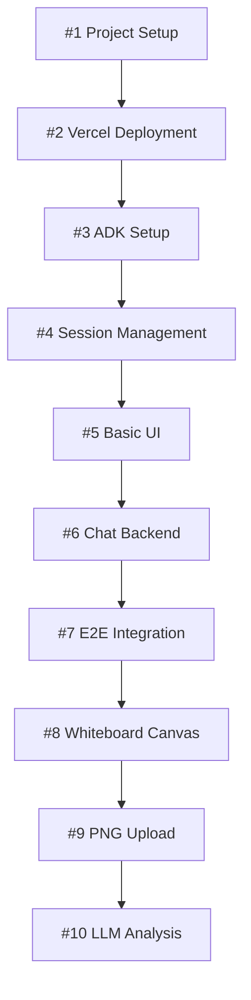

# Claude Code Implementation Plan
## Step-by-Step Development Guide for AI System Design Learning Platform

### Document Information
- **Version**: 1.0
- **Date**: June 2025
- **Purpose**: Detailed implementation roadmap for Claude Code with GitHub integration
- **Testing**: Each step includes verification criteria and testing procedures

---

## 1. Implementation Strategy Overview

### 1.1 Development Approach
**Incremental Development**: Each phase builds upon the previous, with working functionality at every step
**Test-Driven Progression**: Every step has clear acceptance criteria and testing procedures
**GitHub Integration**: Each step maps to specific GitHub Issues with labels, milestones, and projects

### 1.2 Testing Strategy
- **Unit Tests**: Individual component testing
- **Integration Tests**: API endpoint and service integration testing  
- **End-to-End Tests**: Complete user flow validation
- **Manual Testing**: UI/UX verification and user experience testing

### 1.3 Project Structure
```
systemdesign-ai-platform/
├── frontend/          # NextJS application
├── backend/           # FastAPI + ADK integration
├── tests/            # All test files
├── docs/             # Documentation
├── .github/          # GitHub workflows and templates
└── deployment/      # Deployment configurations
```

---

## 2. Phase 1: Foundation & Core Setup (Weeks 1-4)

### 2.1 Environment Setup & Project Initialization

#### **Issue #1: Project Setup and Repository Structure**
**Epic**: Foundation Setup  
**Labels**: `setup`, `foundation`, `p0-critical`  
**Milestone**: Phase 1 - Foundation  

**Description:**
Set up the complete project structure with proper tooling and development environment.

**Acceptance Criteria:**
- [ ] Repository created with proper folder structure
- [ ] NextJS frontend initialized with TypeScript
- [ ] FastAPI backend setup with proper project structure
- [ ] Development environment configuration (Docker/local)
- [ ] Basic CI/CD pipeline setup
- [ ] Code formatting and linting tools configured
- [ ] Environment variables template created

**Testing:**
```bash
# Verify frontend starts
cd frontend && npm run dev

# Verify backend starts  
cd backend && uvicorn main:app --reload

# Verify tests run
npm test
pytest
```

**Definition of Done:**
- Both frontend and backend start without errors
- Basic test suite passes
- CI/CD pipeline runs successfully
- Documentation is updated

---

#### **Issue #2: Vercel Deployment Pipeline Setup**
**Epic**: Foundation Setup  
**Labels**: `deployment`, `vercel`, `p0-critical`  
**Milestone**: Phase 1 - Foundation  

**Description:**
Configure Vercel deployment for both frontend and backend with proper environment management.

**Acceptance Criteria:**
- [ ] Vercel project configured for NextJS frontend
- [ ] Vercel serverless functions setup for FastAPI backend
- [ ] Environment variables configured in Vercel
- [ ] Automatic deployments on push to main branch
- [ ] Preview deployments for pull requests
- [ ] Health check endpoints implemented

**Testing:**
```bash
# Test local deployment
vercel dev

# Test production deployment
vercel --prod

# Verify health endpoints
curl https://your-app.vercel.app/health
curl https://your-app.vercel.app/api/health
```

**Definition of Done:**
- Application accessible via Vercel URL
- Health checks return 200 status
- Environment variables work correctly
- Deployment logs show no errors

---

### 2.2 Google ADK Integration

#### **Issue #3: Google ADK Basic Setup and Authentication**
**Epic**: ADK Integration  
**Labels**: `adk`, `authentication`, `p0-critical`  
**Milestone**: Phase 1 - Foundation  

**Description:**
Set up Google ADK with basic authentication and create a simple "Hello World" agent.

**Acceptance Criteria:**
- [ ] Google ADK installed and configured
- [ ] Google Cloud credentials properly set up
- [ ] Basic agent created with simple responses
- [ ] Agent can be invoked via API
- [ ] Error handling for authentication failures
- [ ] Logging configured for ADK operations

**Testing:**
```python
# Test basic agent interaction
from google.adk.agents import LlmAgent

agent = LlmAgent(
    name="test_agent",
    model="gemini-2.0-flash",
    instruction="You are a helpful assistant."
)

# Test API endpoint
response = requests.post("/api/chat", json={
    "message": "Hello, how are you?",
    "user_id": "test_user"
})
assert response.status_code == 200
```

**Definition of Done:**
- Agent responds to basic queries
- API endpoint returns proper responses
- Authentication works without errors
- Logs show successful ADK operations

---

#### **Issue #4: ADK Session Management and State**
**Epic**: ADK Integration  
**Labels**: `adk`, `session`, `state`, `p1-high`  
**Milestone**: Phase 1 - Foundation  

**Description:**
Implement session management using ADK's SessionService with basic state handling.

**Acceptance Criteria:**
- [ ] InMemorySessionService configured for development
- [ ] Session creation and retrieval working
- [ ] Basic state management (user preferences, progress)
- [ ] Session persistence across API calls
- [ ] Session cleanup and expiration handling
- [ ] User context maintained in session state

**Testing:**
```python
# Test session creation
response = requests.post("/api/session/create", json={
    "user_id": "test_user",
    "initial_state": {"skill_level": "intermediate"}
})

# Test state persistence
response = requests.get("/api/session/test_user")
assert response.json()["state"]["skill_level"] == "intermediate"

# Test multiple interactions maintain context
response1 = requests.post("/api/chat", json={
    "message": "I want to learn about Twitter design",
    "user_id": "test_user"
})

response2 = requests.post("/api/chat", json={
    "message": "What are the main components?",
    "user_id": "test_user"  
})
# Verify agent remembers previous context
```

**Definition of Done:**
- Sessions persist across multiple API calls
- State updates correctly
- Context maintained in conversations
- Session cleanup works properly

---

### 2.3 Basic UI and API Endpoints

#### **Issue #5: Basic Frontend UI with Chat Interface**
**Epic**: Frontend Development  
**Labels**: `frontend`, `ui`, `chat`, `p1-high`  
**Milestone**: Phase 1 - Foundation  

**Description:**
Create basic chat interface using NextJS, Tailwind CSS, and Shadcn UI components.

**Acceptance Criteria:**
- [ ] Basic chat interface with message input and display
- [ ] Tailwind CSS configured and working
- [ ] Shadcn UI components integrated
- [ ] Responsive design for desktop and tablet
- [ ] Message history display
- [ ] Loading states and error handling
- [ ] Basic user authentication UI

**Testing:**
```javascript
// Test chat component
import { render, screen, fireEvent } from '@testing-library/react'
import ChatInterface from '@/components/ChatInterface'

test('sends message when form submitted', () => {
  render(<ChatInterface />)
  
  const input = screen.getByPlaceholderText('Type your message...')
  const button = screen.getByText('Send')
  
  fireEvent.change(input, { target: { value: 'Hello' } })
  fireEvent.click(button)
  
  expect(screen.getByText('Hello')).toBeInTheDocument()
})
```

**Definition of Done:**
- Chat interface renders correctly
- Messages can be sent and displayed
- UI is responsive and accessible
- Error states display properly

---

#### **Issue #6: FastAPI Backend with Basic Chat Endpoint**
**Epic**: Backend Development  
**Labels**: `backend`, `api`, `chat`, `p1-high`  
**Milestone**: Phase 1 - Foundation  

**Description:**
Create FastAPI backend with basic chat endpoint that integrates with ADK agent.

**Acceptance Criteria:**
- [ ] FastAPI application structure established
- [ ] Chat endpoint (`POST /api/chat`) implemented
- [ ] Request/response models defined with Pydantic
- [ ] CORS configuration for frontend integration
- [ ] Error handling and logging
- [ ] Input validation and sanitization
- [ ] Rate limiting basic implementation

**Testing:**
```python
from fastapi.testclient import TestClient
from main import app

client = TestClient(app)

def test_chat_endpoint():
    response = client.post("/api/chat", json={
        "message": "Hello, how are you?",
        "user_id": "test_user"
    })
    
    assert response.status_code == 200
    data = response.json()
    assert "response" in data
    assert "session_id" in data
    assert data["status"] == "success"

def test_chat_endpoint_validation():
    response = client.post("/api/chat", json={
        "message": "",  # Empty message
        "user_id": "test_user"
    })
    
    assert response.status_code == 422  # Validation error
```

**Definition of Done:**
- API endpoint accepts and processes requests correctly
- Responses follow defined schema
- Error handling works properly
- Integration with frontend successful

---

#### **Issue #7: End-to-End Chat Flow Integration**
**Epic**: Integration Testing  
**Labels**: `integration`, `e2e`, `chat`, `p1-high`  
**Milestone**: Phase 1 - Foundation  

**Description:**
Complete integration between frontend and backend for basic chat functionality.

**Acceptance Criteria:**
- [ ] Frontend can send messages to backend
- [ ] Backend processes messages through ADK agent
- [ ] Responses display correctly in frontend
- [ ] Error handling works end-to-end
- [ ] Loading states during API calls
- [ ] Session management works across frontend/backend

**Testing:**
```javascript
// E2E test with Playwright
import { test, expect } from '@playwright/test'

test('complete chat flow', async ({ page }) => {
  await page.goto('/')
  
  // Type message
  await page.fill('[data-testid=message-input]', 'Hello, I want to learn system design')
  await page.click('[data-testid=send-button]')
  
  // Wait for response
  await expect(page.locator('[data-testid=ai-response]')).toBeVisible()
  
  // Verify response contains relevant content
  await expect(page.locator('[data-testid=ai-response]')).toContainText('system design')
})
```

**Definition of Done:**
- Complete chat flow works without errors
- Messages persist in UI
- Error states handled gracefully
- Performance is acceptable (<2s response time)

---

## 3. Phase 2: Core Features Development (Weeks 5-8)

### 3.1 Whiteboard Implementation

#### **Issue #8: HTML5 Canvas Whiteboard Component**
**Epic**: Whiteboard Feature  
**Labels**: `frontend`, `whiteboard`, `canvas`, `p0-critical`  
**Milestone**: Phase 2 - Core Features  

**Description:**
Create interactive HTML5 Canvas component with drawing tools and basic functionality.

**Acceptance Criteria:**
- [ ] Canvas component with drawing capabilities
- [ ] Drawing tools (pen, rectangle, circle, text, arrow)
- [ ] Color and size selection
- [ ] Undo/redo functionality
- [ ] Clear canvas option
- [ ] Save canvas as PNG functionality
- [ ] Responsive canvas sizing

**Testing:**
```javascript
import { render, screen, fireEvent } from '@testing-library/react'
import WhiteboardCanvas from '@/components/WhiteboardCanvas'

test('canvas allows drawing', () => {
  render(<WhiteboardCanvas />)
  
  const canvas = screen.getByTestId('whiteboard-canvas')
  
  // Simulate drawing
  fireEvent.mouseDown(canvas, { clientX: 100, clientY: 100 })
  fireEvent.mouseMove(canvas, { clientX: 150, clientY: 150 })
  fireEvent.mouseUp(canvas)
  
  // Verify drawing occurred (canvas data changed)
  expect(canvas.toDataURL()).not.toBe(/* initial empty canvas data */)
})

test('save PNG functionality', () => {
  render(<WhiteboardCanvas />)
  
  const saveButton = screen.getByText('Save PNG')
  fireEvent.click(saveButton)
  
  // Verify PNG blob is created
  expect(/* PNG data */).toBeDefined()
})
```

**Definition of Done:**
- Canvas renders and responds to drawing
- All drawing tools work correctly
- PNG export functionality works
- Component is responsive

---

#### **Issue #9: PNG Capture and Upload Functionality**
**Epic**: Whiteboard Feature  
**Labels**: `frontend`, `backend`, `png-capture`, `p0-critical`  
**Milestone**: Phase 2 - Core Features  

**Description:**
Implement PNG capture from canvas and upload to backend for analysis.

**Acceptance Criteria:**
- [ ] Canvas PNG capture functionality
- [ ] PNG upload API endpoint
- [ ] File size optimization and compression
- [ ] Error handling for upload failures
- [ ] Progress indication during upload
- [ ] Validation of PNG format
- [ ] Integration with ADK artifacts system

**Testing:**
```python
def test_png_upload():
    # Create test PNG data
    png_data = base64.b64encode(test_png_bytes).decode()
    
    response = client.post("/api/whiteboard/upload", json={
        "png_data": png_data,
        "user_id": "test_user",
        "session_id": "test_session"
    })
    
    assert response.status_code == 200
    data = response.json()
    assert "artifact_id" in data
    assert data["status"] == "success"

def test_invalid_png_upload():
    response = client.post("/api/whiteboard/upload", json={
        "png_data": "invalid_data",
        "user_id": "test_user"
    })
    
    assert response.status_code == 400
```

**Definition of Done:**
- PNG upload works reliably
- Artifacts are stored correctly
- Error handling works properly
- File size is optimized

---

#### **Issue #10: Multimodal LLM Analysis Integration**
**Epic**: Whiteboard Feature  
**Labels**: `backend`, `multimodal-llm`, `analysis`, `p0-critical`  
**Milestone**: Phase 2 - Core Features  

**Description:**
Integrate multimodal LLM (GPT-4V/Claude 3.5 Sonnet) for whiteboard analysis.

**Acceptance Criteria:**
- [ ] Multimodal LLM integration setup
- [ ] PNG analysis endpoint implementation
- [ ] Structured analysis prompt creation
- [ ] Response parsing and formatting
- [ ] Error handling for LLM failures
- [ ] Cost tracking for multimodal calls
- [ ] Confidence scoring for analysis quality

**Testing:**
```python
def test_whiteboard_analysis():
    # Upload test whiteboard PNG
    upload_response = client.post("/api/whiteboard/upload", json={
        "png_data": test_png_data,
        "user_id": "test_user"
    })
    
    artifact_id = upload_response.json()["artifact_id"]
    
    # Request analysis
    analysis_response = client.post("/api/whiteboard/analyze", json={
        "artifact_id": artifact_id,
        "user_id": "test_user",
        "analysis_type": "comprehensive"
    })
    
    assert analysis_response.status_code == 200
    data = analysis_response.json()
    assert "components_identified" in data
    assert "architectural_feedback" in data
    assert "suggestions" in data
    assert data["confidence_score"] > 0
```

**Definition of Done:**
- LLM analyzes whiteboard images correctly
- Analysis returns structured feedback
- Error handling works for LLM failures
- Cost tracking is implemented

---

#### **Issue #11: Real-time Whiteboard Feedback UI**
**Epic**: Whiteboard Feature  
**Labels**: `frontend`, `feedback`, `ui`, `p1-high`  
**Milestone**: Phase 2 - Core Features  

**Description:**
Create UI to display real-time feedback from whiteboard analysis.

**Acceptance Criteria:**
- [ ] Feedback panel component
- [ ] Real-time feedback display
- [ ] Categorized feedback (components, suggestions, improvements)
- [ ] Visual indicators for feedback quality
- [ ] Feedback history tracking
- [ ] Integration with whiteboard canvas
- [ ] Loading states during analysis

**Testing:**
```javascript
test('feedback displays after analysis', async () => {
  render(<WhiteboardWithFeedback />)
  
  // Draw something
  const canvas = screen.getByTestId('whiteboard-canvas')
  fireEvent.mouseDown(canvas, { clientX: 100, clientY: 100 })
  fireEvent.mouseMove(canvas, { clientX: 200, clientY: 200 })
  fireEvent.mouseUp(canvas)
  
  // Request analysis
  fireEvent.click(screen.getByText('Analyze Design'))
  
  // Wait for feedback
  await waitFor(() => {
    expect(screen.getByTestId('feedback-panel')).toBeVisible()
  })
  
  // Verify feedback content
  expect(screen.getByText(/components identified/i)).toBeInTheDocument()
})
```

**Definition of Done:**
- Feedback displays correctly after analysis
- UI is responsive and user-friendly
- Loading states work properly
- Feedback is categorized and clear

---

### 3.2 Assessment System Implementation

#### **Issue #12: LLM Judge Implementation with 6-Dimensional Scoring**
**Epic**: Assessment System  
**Labels**: `backend`, `assessment`, `llm-judge`, `p0-critical`  
**Milestone**: Phase 2 - Core Features  

**Description:**
Implement comprehensive LLM judge system with detailed 6-dimensional assessment framework.

**Acceptance Criteria:**
- [ ] Assessment prompt engineering with detailed rubrics
- [ ] 6-dimensional scoring implementation
- [ ] Confidence scoring for assessments
- [ ] Structured assessment response parsing
- [ ] Assessment storage and retrieval
- [ ] Integration with session state
- [ ] Assessment history tracking

**Testing:**
```python
def test_assessment_system():
    response = client.post("/api/assessment/evaluate", json={
        "user_id": "test_user",
        "interaction_context": "User explained microservices architecture",
        "whiteboard_feedback": {"components": ["api_gateway", "services"]},
        "conversation_history": "Discussion about Twitter design"
    })
    
    assert response.status_code == 200
    data = response.json()
    
    # Verify 6-dimensional scores
    assert "dimension_scores" in data
    dimensions = data["dimension_scores"]
    assert "requirements_analysis" in dimensions
    assert "system_architecture" in dimensions
    assert "technical_deep_dive" in dimensions
    assert "scale_performance" in dimensions
    assert "reliability_fault_tolerance" in dimensions
    assert "communication_thought_process" in dimensions
    
    # Verify overall assessment
    assert "overall_score" in data
    assert "confidence_score" in data
    assert "detailed_feedback" in data
    assert 1 <= data["overall_score"] <= 5
    assert 1 <= data["confidence_score"] <= 5
```

**Definition of Done:**
- Assessment system evaluates across all 6 dimensions
- Confidence scoring works correctly
- Assessment results are stored properly
- Feedback is detailed and actionable

---

#### **Issue #13: Progress Dashboard Backend API**
**Epic**: Progress Tracking  
**Labels**: `backend`, `progress`, `analytics`, `p1-high`  
**Milestone**: Phase 2 - Core Features  

**Description:**
Create backend APIs for progress tracking and analytics data.

**Acceptance Criteria:**
- [ ] Progress data storage and retrieval endpoints
- [ ] Timeline data calculation and aggregation
- [ ] Trend analysis implementation
- [ ] Personalized recommendations generation
- [ ] Goal setting and tracking APIs
- [ ] Export functionality for progress reports
- [ ] Performance optimization for large datasets

**Testing:**
```python
def test_progress_tracking():
    # Create multiple assessments over time
    for i in range(5):
        client.post("/api/assessment/evaluate", json={
            "user_id": "test_user",
            "overall_score": 3.0 + (i * 0.2),  # Improving scores
            "dimension_scores": {
                "requirements_analysis": 3.0 + (i * 0.1),
                "system_architecture": 3.0 + (i * 0.2),
                # ... other dimensions
            }
        })
    
    # Get progress data
    response = client.get("/api/progress/test_user")
    assert response.status_code == 200
    
    data = response.json()
    assert "timeline_data" in data
    assert "trends" in data
    assert "recommendations" in data
    assert len(data["timeline_data"]) == 5
    
    # Verify trend detection
    trends = data["trends"]
    assert "improving_areas" in trends
    assert "system_architecture" in trends["improving_areas"]

def test_progress_export():
    response = client.get("/api/progress/export/test_user")
    assert response.status_code == 200
    assert response.headers["content-type"] == "application/pdf"
```

**Definition of Done:**
- Progress APIs return correct data
- Timeline calculations work properly
- Trend analysis identifies patterns correctly
- Export functionality works

---

### 3.3 AI Diagram Generation

#### **Issue #14: Mermaid MCP Server Integration**
**Epic**: Diagram Generation  
**Labels**: `backend`, `mermaid`, `mcp`, `p1-high`  
**Milestone**: Phase 2 - Core Features  

**Description:**
Integrate Mermaid MCP server for diagram generation and rendering.

**Acceptance Criteria:**
- [ ] Mermaid MCP server setup and configuration
- [ ] Diagram generation API endpoint
- [ ] Multiple diagram types support (architecture, sequence, flowchart)
- [ ] PNG rendering from Mermaid code
- [ ] Error handling for invalid Mermaid syntax
- [ ] Diagram storage as artifacts
- [ ] Performance optimization for rendering

**Testing:**
```python
def test_diagram_generation():
    response = client.post("/api/diagrams/generate", json={
        "system_description": "A simple web application with load balancer, web servers, and database",
        "diagram_type": "architecture",
        "user_id": "test_user"
    })
    
    assert response.status_code == 200
    data = response.json()
    
    assert "mermaid_code" in data
    assert "png_url" in data
    assert "diagram_id" in data
    assert data["status"] == "success"
    
    # Verify Mermaid code is valid
    mermaid_code = data["mermaid_code"]
    assert "graph" in mermaid_code or "flowchart" in mermaid_code
    
    # Verify PNG was generated
    png_response = client.get(data["png_url"])
    assert png_response.status_code == 200
    assert png_response.headers["content-type"] == "image/png"

def test_invalid_diagram_request():
    response = client.post("/api/diagrams/generate", json={
        "system_description": "",  # Empty description
        "diagram_type": "invalid_type",
        "user_id": "test_user"
    })
    
    assert response.status_code == 400
```

**Definition of Done:**
- Mermaid diagrams generate correctly
- PNG rendering works reliably
- Multiple diagram types supported
- Error handling works properly

---

#### **Issue #15: Context-Aware Diagram Generation**
**Epic**: Diagram Generation  
**Labels**: `backend`, `ai`, `context`, `p1-high`  
**Milestone**: Phase 2 - Core Features  

**Description:**
Implement intelligent diagram generation based on conversation context.

**Acceptance Criteria:**
- [ ] Context analysis from conversation history
- [ ] Automatic diagram type selection
- [ ] System component extraction from discussion
- [ ] Diagram modification based on user feedback
- [ ] Integration with ADK agent tools
- [ ] Quality assessment of generated diagrams
- [ ] Fallback mechanisms for poor context

**Testing:**
```python
def test_context_aware_generation():
    # Simulate conversation about Twitter architecture
    client.post("/api/chat", json={
        "message": "I want to design Twitter's architecture",
        "user_id": "test_user"
    })
    
    client.post("/api/chat", json={
        "message": "We need load balancers, web servers, and databases",
        "user_id": "test_user"
    })
    
    # Request context-aware diagram
    response = client.post("/api/diagrams/generate-contextual", json={
        "user_id": "test_user",
        "session_id": "test_session"
    })
    
    assert response.status_code == 200
    data = response.json()
    
    # Verify context was used
    mermaid_code = data["mermaid_code"]
    assert "load" in mermaid_code.lower()
    assert "web" in mermaid_code.lower()
    assert "database" in mermaid_code.lower()
```

**Definition of Done:**
- Diagrams reflect conversation context
- Automatic type selection works
- Diagram quality is appropriate
- Context extraction is accurate

---

## 4. Phase 3: Integration & Polish (Weeks 9-12)

### 4.1 Voice Integration

#### **Issue #16: Google ADK Live API Integration**
**Epic**: Voice Feature  
**Labels**: `backend`, `voice`, `live-api`, `p2-medium`  
**Milestone**: Phase 3 - Integration  

**Description:**
Integrate Google ADK Live API for bidirectional voice streaming.

**Acceptance Criteria:**
- [ ] Live API setup and configuration
- [ ] WebSocket endpoint for voice streaming
- [ ] Audio input processing
- [ ] Audio output generation
- [ ] Real-time streaming optimization
- [ ] Error handling for voice failures
- [ ] Fallback to text when voice unavailable

**Testing:**
```python
def test_voice_streaming():
    # Test WebSocket connection
    with client.websocket_connect("/api/voice") as websocket:
        # Send authentication
        websocket.send_text("auth_token_here")
        
        # Send audio data
        websocket.send_bytes(test_audio_data)
        
        # Receive response
        response = websocket.receive()
        assert response["type"] == "websocket.send"
        
        # Verify audio response
        audio_response = websocket.receive_bytes()
        assert len(audio_response) > 0
```

**Definition of Done:**
- Voice streaming works bidirectionally
- Audio quality is acceptable
- Error handling works properly
- Performance meets requirements

---

#### **Issue #17: Frontend Voice Interface**
**Epic**: Voice Feature  
**Labels**: `frontend`, `voice`, `ui`, `p2-medium`  
**Milestone**: Phase 3 - Integration  

**Description:**
Create voice interface components for audio recording and playback.

**Acceptance Criteria:**
- [ ] Audio recording component
- [ ] Audio playback component
- [ ] Voice activity detection
- [ ] Visual feedback for recording state
- [ ] Integration with WebSocket for streaming
- [ ] Microphone permissions handling
- [ ] Browser compatibility testing

**Testing:**
```javascript
test('voice recording starts and stops', async () => {
  render(<VoiceInterface />)
  
  const recordButton = screen.getByTestId('record-button')
  
  // Start recording
  fireEvent.click(recordButton)
  await waitFor(() => {
    expect(screen.getByText('Recording...')).toBeInTheDocument()
  })
  
  // Stop recording
  fireEvent.click(recordButton)
  await waitFor(() => {
    expect(screen.getByText('Processing...')).toBeInTheDocument()
  })
})
```

**Definition of Done:**
- Voice recording works in browsers
- Audio playback functions correctly
- UI provides clear feedback
- Permissions are handled properly

---

### 4.2 Complete Feature Integration

#### **Issue #18: End-to-End Learning Session Flow**
**Epic**: Integration Testing  
**Labels**: `integration`, `e2e`, `learning-flow`, `p1-high`  
**Milestone**: Phase 3 - Integration  

**Description:**
Complete integration test for entire learning session workflow.

**Acceptance Criteria:**
- [ ] Complete user onboarding flow
- [ ] Chapter selection and content loading
- [ ] Interactive conversation with AI agent
- [ ] Whiteboard drawing and analysis
- [ ] AI diagram generation
- [ ] Assessment and feedback
- [ ] Progress tracking and dashboard
- [ ] Session persistence and resumption

**Testing:**
```javascript
test('complete learning session', async ({ page }) => {
  // Start session
  await page.goto('/')
  await page.click('[data-testid=start-learning]')
  
  // Select chapter
  await page.click('[data-testid=chapter-twitter]')
  
  // Interact with AI
  await page.fill('[data-testid=message-input]', 'I want to learn Twitter design')
  await page.click('[data-testid=send-button]')
  await expect(page.locator('[data-testid=ai-response]')).toBeVisible()
  
  // Use whiteboard
  await page.click('[data-testid=whiteboard-tab]')
  // Draw on canvas (simulate mouse events)
  await page.mouse.move(100, 100)
  await page.mouse.down()
  await page.mouse.move(200, 200)
  await page.mouse.up()
  
  // Analyze whiteboard
  await page.click('[data-testid=analyze-button]')
  await expect(page.locator('[data-testid=feedback-panel]')).toBeVisible()
  
  // Generate diagram
  await page.click('[data-testid=generate-diagram]')
  await expect(page.locator('[data-testid=diagram-display]')).toBeVisible()
  
  // Complete assessment
  await page.click('[data-testid=assessment-tab]')
  await page.click('[data-testid=start-assessment]')
  await expect(page.locator('[data-testid=assessment-results]')).toBeVisible()
  
  // Check progress dashboard
  await page.click('[data-testid=progress-tab]')
  await expect(page.locator('[data-testid=progress-timeline]')).toBeVisible()
})
```

**Definition of Done:**
- Complete user flow works without errors
- All features integrate seamlessly
- Performance is acceptable
- Data persists correctly

---

#### **Issue #19: Progress Dashboard Frontend Implementation**
**Epic**: Progress Tracking  
**Labels**: `frontend`, `progress`, `dashboard`, `p1-high`  
**Milestone**: Phase 3 - Integration  

**Description:**
Create comprehensive progress dashboard with timeline visualization.

**Acceptance Criteria:**
- [ ] Timeline chart component with 6 dimensions
- [ ] Trend analysis visualization
- [ ] Personalized recommendations display
- [ ] Achievement badges and milestones
- [ ] Goal setting interface
- [ ] Export functionality for reports
- [ ] Responsive design for all devices

**Testing:**
```javascript
test('progress dashboard displays correctly', () => {
  const mockProgressData = {
    timeline_data: [
      { date: '2025-01-01', overall_score: 3.0, dimension_scores: {...} },
      { date: '2025-01-02', overall_score: 3.2, dimension_scores: {...} },
    ],
    trends: { improving_areas: ['system_architecture'] },
    recommendations: ['Focus on database design'],
    achievements: [{ name: 'First Assessment', earned: true }]
  }
  
  render(<ProgressDashboard data={mockProgressData} />)
  
  // Verify timeline chart
  expect(screen.getByTestId('timeline-chart')).toBeInTheDocument()
  
  // Verify trend indicators
  expect(screen.getByText('Improving: System Architecture')).toBeInTheDocument()
  
  // Verify recommendations
  expect(screen.getByText('Focus on database design')).toBeInTheDocument()
  
  // Verify achievements
  expect(screen.getByText('First Assessment')).toBeInTheDocument()
  
  // Test export functionality
  fireEvent.click(screen.getByText('Export Report'))
  // Verify export starts
})

test('timeline chart is interactive', () => {
  render(<ProgressDashboard data={mockProgressData} />)
  
  const timelineChart = screen.getByTestId('timeline-chart')
  
  // Click on data point
  fireEvent.click(timelineChart.querySelector('[data-testid=data-point-0]'))
  
  // Verify detailed view opens
  expect(screen.getByTestId('assessment-details')).toBeInTheDocument()
})
```

**Definition of Done:**
- Dashboard displays all progress data correctly
- Charts are interactive and responsive
- Export functionality works
- UI is polished and user-friendly

---

## 5. Phase 4: Production Readiness (Weeks 13-16)

### 5.1 Production Deployment

#### **Issue #20: Production Environment Setup**
**Epic**: Production Deployment  
**Labels**: `deployment`, `production`, `infrastructure`, `p0-critical`  
**Milestone**: Phase 4 - Production  

**Description:**
Set up production environment with proper services and configurations.

**Acceptance Criteria:**
- [ ] Production Vercel deployment configuration
- [ ] Environment variables for production
- [ ] Database setup (PostgreSQL for sessions)
- [ ] Redis setup for caching and rate limiting
- [ ] Google Cloud Storage for artifacts
- [ ] Vertex AI RAG setup for memory service
- [ ] Monitoring and logging configuration
- [ ] Security headers and CORS setup

**Testing:**
```bash
# Test production deployment
curl -X POST https://your-app.vercel.app/api/health
curl -X POST https://your-app.vercel.app/api/chat \
  -H "Content-Type: application/json" \
  -d '{"message": "test", "user_id": "test"}'

# Test database connectivity
python -c "import psycopg2; conn = psycopg2.connect('production_db_url')"

# Test Redis connectivity
redis-cli -u production_redis_url ping

# Test GCS access
gsutil ls gs://your-artifacts-bucket
```

**Definition of Done:**
- All production services are operational
- Application deploys without errors
- Health checks pass
- All integrations work in production

---

#### **Issue #21: Monitoring and Observability Setup**
**Epic**: Production Deployment  
**Labels**: `monitoring`, `observability`, `opik`, `p1-high`  
**Milestone**: Phase 4 - Production  

**Description:**
Implement comprehensive monitoring with Comet Opik integration.

**Acceptance Criteria:**
- [ ] Comet Opik integration setup
- [ ] Performance metrics tracking
- [ ] Error tracking and alerting
- [ ] Cost monitoring for API calls
- [ ] User analytics implementation
- [ ] Dashboard creation for key metrics
- [ ] Alert configuration for critical issues
- [ ] Log aggregation and analysis

**Testing:**
```python
def test_monitoring_integration():
    # Test that metrics are being collected
    response = client.post("/api/chat", json={
        "message": "test message",
        "user_id": "test_user"
    })
    
    # Verify metrics were logged to Opik
    # (This would require Opik API or mock verification)
    assert opik_client.get_recent_traces(count=1) is not None

def test_error_tracking():
    # Trigger an error
    response = client.post("/api/chat", json={
        "message": "",  # Invalid input
        "user_id": "test_user"
    })
    
    # Verify error was tracked
    assert response.status_code == 422
    # Verify error was logged to monitoring system
```

**Definition of Done:**
- All metrics are being tracked
- Alerts trigger correctly
- Dashboards display real-time data
- Error tracking captures issues

---

### 5.2 Security and Performance

#### **Issue #22: Security Implementation**
**Epic**: Security  
**Labels**: `security`, `authentication`, `privacy`, `p0-critical`  
**Milestone**: Phase 4 - Production  

**Description:**
Implement comprehensive security measures and privacy controls.

**Acceptance Criteria:**
- [ ] User authentication and authorization
- [ ] Rate limiting implementation
- [ ] Input validation and sanitization
- [ ] PII detection and masking
- [ ] GDPR compliance features
- [ ] Audit logging implementation
- [ ] Security headers configuration
- [ ] API security best practices

**Testing:**
```python
def test_rate_limiting():
    # Send multiple requests rapidly
    for i in range(10):
        response = client.post("/api/chat", json={
            "message": f"test {i}",
            "user_id": "test_user"
        })
    
    # Should get rate limited
    assert response.status_code == 429

def test_input_sanitization():
    response = client.post("/api/chat", json={
        "message": "<script>alert('xss')</script>",
        "user_id": "test_user"
    })
    
    # Should sanitize input
    assert "<script>" not in response.json()["response"]

def test_pii_detection():
    response = client.post("/api/chat", json={
        "message": "My email is john@example.com",
        "user_id": "test_user"
    })
    
    # Email should be masked in logs
    # Verify through monitoring/logging system
```

**Definition of Done:**
- All security measures are active
- Rate limiting works correctly
- PII is properly masked
- Audit logs are being created

---

#### **Issue #23: Performance Optimization**
**Epic**: Performance  
**Labels**: `performance`, `optimization`, `caching`, `p1-high`  
**Milestone**: Phase 4 - Production  

**Description:**
Optimize application performance for production load.

**Acceptance Criteria:**
- [ ] API response time optimization (<2s)
- [ ] Caching implementation for expensive operations
- [ ] Database query optimization
- [ ] Frontend bundle optimization
- [ ] Image compression and optimization
- [ ] CDN setup for static assets
- [ ] Load testing and capacity planning
- [ ] Performance monitoring setup

**Testing:**
```python
import time
import concurrent.futures

def test_response_time():
    start_time = time.time()
    response = client.post("/api/chat", json={
        "message": "test message",
        "user_id": "test_user"
    })
    end_time = time.time()
    
    assert response.status_code == 200
    assert (end_time - start_time) < 2.0  # Under 2 seconds

def test_concurrent_load():
    def make_request():
        return client.post("/api/chat", json={
            "message": "load test",
            "user_id": f"user_{random.randint(1, 100)}"
        })
    
    # Test 50 concurrent requests
    with concurrent.futures.ThreadPoolExecutor(max_workers=50) as executor:
        futures = [executor.submit(make_request) for _ in range(50)]
        results = [future.result() for future in futures]
    
    # All requests should succeed
    success_count = sum(1 for r in results if r.status_code == 200)
    assert success_count >= 45  # 90% success rate

def test_caching():
    # First request (should be slow)
    start_time = time.time()
    response1 = client.post("/api/whiteboard/analyze", json={
        "artifact_id": "test_artifact",
        "user_id": "test_user"
    })
    first_time = time.time() - start_time
    
    # Second identical request (should be fast due to caching)
    start_time = time.time()
    response2 = client.post("/api/whiteboard/analyze", json={
        "artifact_id": "test_artifact",
        "user_id": "test_user"
    })
    second_time = time.time() - start_time
    
    assert response1.status_code == 200
    assert response2.status_code == 200
    assert second_time < (first_time * 0.5)  # 50% faster due to cache
```

**Definition of Done:**
- Response times meet targets
- Caching reduces redundant operations
- Application handles concurrent load
- Performance metrics are within acceptable ranges

---

#### **Issue #24: Persistent Session Storage with ADK Artifacts**
**Epic**: Session Management  
**Labels**: `backend`, `adk`, `persistence`, `session`, `p1-high`  
**Milestone**: Phase 4 - Production  

**Description:**
Implement persistent session storage using ADK artifacts for long-term user continuity and production scalability.

**Acceptance Criteria:**
- [ ] ADK artifacts integration for session persistence
- [ ] Session state backup to artifacts on session updates
- [ ] Session restoration from artifacts on user return
- [ ] Conversation history preservation across server restarts
- [ ] Learning progress continuity after long user absences
- [ ] Fallback mechanisms for corrupted or missing artifacts
- [ ] Migration from in-memory to persistent storage
- [ ] Performance optimization for artifact operations
- [ ] Cleanup of old session artifacts

**Testing:**
```python
def test_session_persistence():
    # Create session with state
    response = client.post("/api/session/create", json={
        "user_id": "test_user",
        "initial_state": {"skill_level": "advanced", "progress": {"completed": ["twitter"]}}
    })
    session_id = response.json()["session_id"]
    
    # Simulate server restart (clear in-memory storage)
    service._session_states.clear()
    service._session_creation_time.clear()
    
    # User returns after restart
    chat_response = client.post("/api/chat", json={
        "message": "Continue where we left off",
        "user_id": "test_user",
        "session_id": session_id
    })
    
    # Verify session was restored from artifacts
    assert chat_response.status_code == 200
    assert "twitter" in chat_response.json()["context_used"]

def test_long_term_continuity():
    # Create session and let it expire (simulate 3 months gap)
    session_id = create_test_session()
    
    # Mock very old timestamp (expired by time)
    service._session_creation_time[session_id] = time.time() - (3 * 30 * 24 * 3600)
    
    # User returns after long absence
    response = client.post("/api/chat", json={
        "message": "I'm back! Can we continue?",
        "user_id": "test_user",
        "session_id": session_id
    })
    
    # Should restore from artifacts despite expiry
    assert response.status_code == 200
    assert response.json()["session_restored"] == True

def test_artifact_cleanup():
    # Create multiple old sessions
    old_sessions = []
    for i in range(5):
        session = create_test_session(f"user_{i}")
        old_sessions.append(session)
    
    # Run cleanup
    service.cleanup_old_session_artifacts(days_old=90)
    
    # Verify old artifacts are cleaned up
    for session_id in old_sessions:
        with pytest.raises(ArtifactNotFound):
            service.get_session_from_artifacts(session_id)

def test_migration_from_memory():
    # Test migration of existing in-memory sessions to persistent storage
    service._session_states["test_session"] = {"skill": "expert"}
    service._session_creation_time["test_session"] = time.time()
    
    # Trigger migration
    service.migrate_memory_sessions_to_artifacts()
    
    # Verify session is now in artifacts
    restored_session = service.get_session_from_artifacts("test_session")
    assert restored_session["skill"] == "expert"
```

**Definition of Done:**
- Sessions persist across server restarts
- Users can resume learning after months of absence
- Conversation history and progress maintained
- Performance impact of artifact operations minimal
- Old artifacts are cleaned up automatically
- Migration from in-memory storage successful
- Fallback mechanisms handle edge cases

---

#### **Issue #25: Comprehensive Testing Suite**
**Epic**: Testing  
**Labels**: `testing`, `qa`, `automation`, `p1-high`  
**Milestone**: Phase 4 - Production  

**Description:**
Create comprehensive test suite covering all functionality.

**Acceptance Criteria:**
- [ ] Unit tests for all components (>90% coverage)
- [ ] Integration tests for all API endpoints
- [ ] End-to-end tests for complete user flows
- [ ] Performance tests for load scenarios
- [ ] Security tests for common vulnerabilities
- [ ] Automated test execution in CI/CD
- [ ] Test reporting and metrics
- [ ] Regression test suite

**Testing:**
```bash
# Run all tests
npm test                    # Frontend unit tests
pytest                     # Backend unit tests
npm run test:integration    # Integration tests
npm run test:e2e           # End-to-end tests
npm run test:performance   # Performance tests

# Coverage reporting
npm run test:coverage
pytest --cov=app --cov-report=html

# Security testing
npm audit
bandit -r app/
```

**Definition of Done:**
- All test suites pass consistently
- Code coverage meets targets (>90%)
- CI/CD pipeline runs all tests
- Test reports are generated automatically

---

## 6. GitHub Integration & Project Management

### 6.1 GitHub Project Setup

#### **Repository Structure**
```
systemdesign-ai-platform/
├── .github/
│   ├── workflows/
│   │   ├── ci.yml
│   │   ├── cd.yml
│   │   └── test.yml
│   ├── ISSUE_TEMPLATE/
│   │   ├── bug_report.md
│   │   ├── feature_request.md
│   │   └── epic.md
│   └── PULL_REQUEST_TEMPLATE.md
├── frontend/
├── backend/
├── tests/
└── docs/
```

#### **Labels for Issue Management**
```yaml
# Priority Labels
- name: "p0-critical"
  color: "d73a4a"
  description: "Critical priority - blocks other work"

- name: "p1-high" 
  color: "f97316"
  description: "High priority - important for milestone"

- name: "p2-medium"
  color: "eab308"
  description: "Medium priority - nice to have"

- name: "p3-low"
  color: "22c55e"
  description: "Low priority - future consideration"

# Component Labels
- name: "frontend"
  color: "3b82f6"
  description: "Frontend/UI related"

- name: "backend"
  color: "8b5cf6"
  description: "Backend/API related"

- name: "adk"
  color: "ec4899"
  description: "Google ADK integration"

- name: "testing"
  color: "6b7280"
  description: "Testing and QA"

# Type Labels
- name: "epic"
  color: "7c3aed"
  description: "Large feature or initiative"

- name: "bug"
  color: "dc2626"
  description: "Something isn't working"

- name: "enhancement"
  color: "16a34a"
  description: "New feature or improvement"
```

#### **Milestones Configuration**
```yaml
Phase 1 - Foundation:
  due_date: "2025-07-22"
  description: "Core setup and basic functionality"

Phase 2 - Core Features:
  due_date: "2025-08-19" 
  description: "Whiteboard, assessment, and diagram generation"

Phase 3 - Integration:
  due_date: "2025-09-16"
  description: "Voice integration and feature polish"

Phase 4 - Production:
  due_date: "2025-10-14"
  description: "Production deployment and optimization"
```

### 6.2 Issue Templates

#### **Epic Template**
```markdown
# Epic: [Epic Name]

## Overview
Brief description of the epic and its business value.

## User Stories
- As a [user type], I want [functionality] so that [benefit]
- As a [user type], I want [functionality] so that [benefit]

## Acceptance Criteria
- [ ] Criterion 1
- [ ] Criterion 2
- [ ] Criterion 3

## Child Issues
- [ ] #[issue-number] - [Issue title]
- [ ] #[issue-number] - [Issue title]

## Definition of Done
- [ ] All child issues completed
- [ ] Integration tests pass
- [ ] Documentation updated
- [ ] Performance criteria met

## Dependencies
- Depends on: #[issue-number]
- Blocks: #[issue-number]

## Estimated Effort
[Story points or time estimate]
```

#### **Feature Issue Template**
```markdown
# Feature: [Feature Name]

## Description
Detailed description of what needs to be implemented.

## Acceptance Criteria
- [ ] Specific, testable criterion 1
- [ ] Specific, testable criterion 2
- [ ] Specific, testable criterion 3

## Testing Requirements
### Unit Tests
```python
def test_feature_functionality():
    # Test code example
    pass
```

### Integration Tests
```python
def test_feature_integration():
    # Integration test example
    pass
```

### Manual Testing
- [ ] Test scenario 1
- [ ] Test scenario 2

## Definition of Done
- [ ] Code implemented and reviewed
- [ ] Tests written and passing
- [ ] Documentation updated
- [ ] Deployed to staging
- [ ] Acceptance criteria verified

## Dependencies
- Requires: #[issue-number]
- Related to: #[issue-number]

## Estimated Effort
[Story points: 1, 2, 3, 5, 8, 13]
```

### 6.3 Workflow Automation

#### **GitHub Actions for CI/CD**
```yaml
# .github/workflows/ci.yml
name: Continuous Integration

on:
  push:
    branches: [ main, develop ]
  pull_request:
    branches: [ main ]

jobs:
  test-frontend:
    runs-on: ubuntu-latest
    steps:
      - uses: actions/checkout@v3
      - uses: actions/setup-node@v3
        with:
          node-version: '18'
      - run: cd frontend && npm ci
      - run: cd frontend && npm test
      - run: cd frontend && npm run build

  test-backend:
    runs-on: ubuntu-latest
    steps:
      - uses: actions/checkout@v3
      - uses: actions/setup-python@v4
        with:
          python-version: '3.11'
      - run: cd backend && pip install -r requirements.txt
      - run: cd backend && pytest
      - run: cd backend && flake8

  deploy-staging:
    if: github.ref == 'refs/heads/develop'
    needs: [test-frontend, test-backend]
    runs-on: ubuntu-latest
    steps:
      - uses: actions/checkout@v3
      - run: vercel --prod --token ${{ secrets.VERCEL_TOKEN }}
```

#### **Project Automation Rules**
```yaml
# Automatically assign labels based on file changes
- if: changed-files matches "frontend/**"
  then: add-label "frontend"

- if: changed-files matches "backend/**" 
  then: add-label "backend"

# Auto-assign to project board
- if: issue created with label "p0-critical"
  then: add-to-project "System Design AI Development"

# Auto-close stale issues
- if: issue inactive for 30 days
  then: add-label "stale"
  
- if: issue inactive for 45 days AND has-label "stale"
  then: close-issue
```

### 6.4 Development Workflow

#### **Branch Strategy**
```
main          # Production-ready code
├── develop   # Integration branch for features
├── feature/issue-8-whiteboard-canvas
├── feature/issue-12-llm-judge
└── hotfix/critical-bug-fix
```

#### **Pull Request Process**
1. **Create branch** from develop: `git checkout -b feature/issue-[number]-[description]`
2. **Implement feature** following the issue acceptance criteria
3. **Write tests** that verify the acceptance criteria
4. **Update documentation** if needed
5. **Create pull request** with:
   - Clear title referencing issue: "Feature: Implement whiteboard canvas (#8)"
   - Description linking to issue: "Closes #8"
   - Screenshots/videos for UI changes
   - Test results and coverage reports
6. **Code review** by team members
7. **Merge** after approval and tests pass

#### **Issue Lifecycle**
```
Open → In Progress → In Review → Testing → Done
  ↓        ↓           ↓         ↓        ↓
  ○        ●           ◐         ◑        ●
```

**Status Automation:**
- **Open**: Issue created and triaged
- **In Progress**: Automatically set when PR opened referencing issue
- **In Review**: Set when PR is ready for review
- **Testing**: Set when PR is merged to develop branch
- **Done**: Set when changes are deployed to production

---

## 7. Best Practices for Claude Code Integration

### 7.1 Issue Assignment Strategy

#### **Sequential Implementation**
1. **Start with Phase 1, Issue #1**
2. **Complete all acceptance criteria** before moving to next issue
3. **Run all tests** and verify they pass
4. **Deploy to staging** and test manually
5. **Mark issue as complete** only when all criteria met
6. **Move to next issue** in sequence

#### **Issue Dependencies**


### 7.2 Quality Gates

#### **Before Moving to Next Issue**
- [ ] All acceptance criteria completed
- [ ] Unit tests written and passing (>90% coverage)
- [ ] Integration tests passing
- [ ] Manual testing completed
- [ ] Code reviewed (if working with team)
- [ ] Documentation updated
- [ ] Changes deployed to staging
- [ ] Performance benchmarks met

#### **Before Moving to Next Phase**
- [ ] All phase issues completed
- [ ] End-to-end testing passes
- [ ] Performance testing completed
- [ ] Security testing completed
- [ ] Stakeholder review and approval
- [ ] Production deployment successful

### 7.3 Testing and Validation

#### **Automated Testing Pipeline**
```bash
# Run before marking issue complete
npm run test:all          # All tests
npm run test:coverage     # Coverage report
npm run lint             # Code quality
npm run security         # Security scan
npm run performance      # Performance tests
```

#### **Manual Testing Checklist**
```markdown
## Manual Testing Checklist for Issue #[X]

### Functional Testing
- [ ] Feature works as described in acceptance criteria
- [ ] Error scenarios handled gracefully
- [ ] Edge cases covered
- [ ] Integration with existing features works

### UI/UX Testing (if applicable)
- [ ] Responsive design works on desktop/tablet
- [ ] Accessibility requirements met
- [ ] Loading states display correctly
- [ ] Error messages are user-friendly

### Performance Testing
- [ ] Response times meet requirements (<2s)
- [ ] No memory leaks or performance degradation
- [ ] Concurrent usage scenarios work

### Security Testing
- [ ] Input validation prevents injection attacks
- [ ] Authentication/authorization works correctly
- [ ] Sensitive data is protected
```

---

## 8. Implementation Success Criteria

### 8.1 Phase Completion Criteria

#### **Phase 1 Success Criteria**
- [ ] Complete chat functionality working end-to-end
- [ ] ADK integration operational
- [ ] Session management persistent
- [ ] Basic UI responsive and functional
- [ ] Deployment pipeline operational
- [ ] All Phase 1 tests passing

#### **Phase 2 Success Criteria**
- [ ] Whiteboard drawing and PNG analysis working
- [ ] 6-dimensional assessment system operational
- [ ] AI diagram generation functional
- [ ] Real-time feedback system working
- [ ] Progress tracking backend complete
- [ ] All integrations stable

#### **Phase 3 Success Criteria**
- [ ] Voice integration working (optional)
- [ ] Progress dashboard fully functional
- [ ] Complete learning session flow working
- [ ] All features integrated seamlessly
- [ ] Performance meets requirements
- [ ] User experience polished

#### **Phase 4 Success Criteria**
- [ ] Production deployment successful
- [ ] Monitoring and alerting operational
- [ ] Security measures implemented
- [ ] Performance optimized
- [ ] Comprehensive testing complete
- [ ] Ready for beta users

### 8.2 Overall Success Metrics

#### **Technical Metrics**
- **Response Time**: <2 seconds for all API calls
- **Uptime**: >99.5% availability
- **Test Coverage**: >90% code coverage
- **Performance**: Handles 100+ concurrent users
- **Security**: No critical vulnerabilities

#### **User Experience Metrics**
- **Session Completion**: >70% completion rate
- **User Satisfaction**: >4.2/5 rating
- **Feature Usage**: >80% of users try whiteboard
- **Progress Tracking**: >60% engage with dashboard
- **Error Rate**: <5% user-facing errors

---

## 9. Conclusion

This implementation plan provides a systematic approach to building the AI System Design Learning Platform with clear milestones, testable deliverables, and GitHub integration. Each issue is designed to be self-contained with specific acceptance criteria, testing requirements, and definition of done.

**Key Benefits:**
- **Incremental Progress**: Each issue delivers working functionality
- **Clear Testing**: Every step has verification criteria
- **GitHub Integration**: Issues map directly to project management
- **Risk Mitigation**: Dependencies and testing catch issues early
- **Quality Assurance**: Multiple testing layers ensure reliability

**Next Steps:**
1. Set up GitHub repository with labels, milestones, and templates
2. Create all 24 issues in GitHub with proper labels and assignments
3. Configure project board for visual progress tracking
4. Begin implementation with Issue #1: Project Setup
5. Follow the sequential workflow, completing each phase fully

This approach ensures systematic development with clear progress indicators and quality gates at every step. 🚀