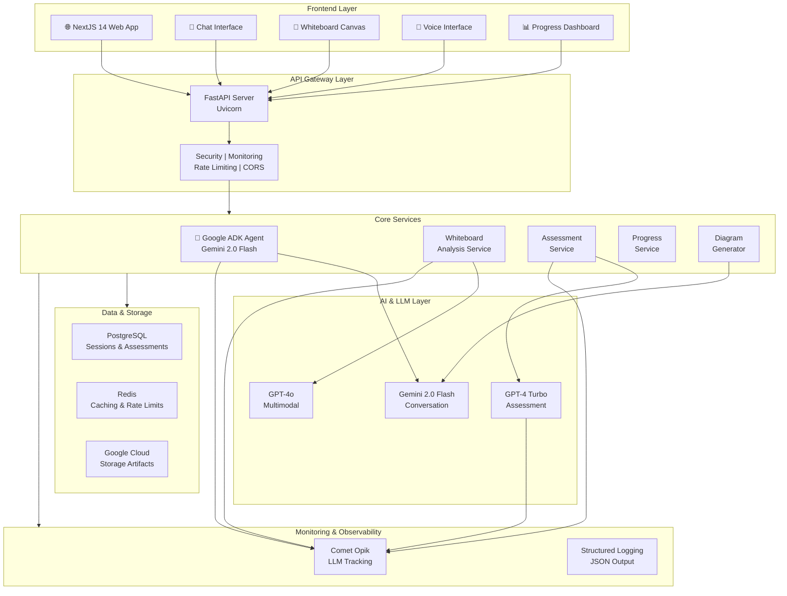
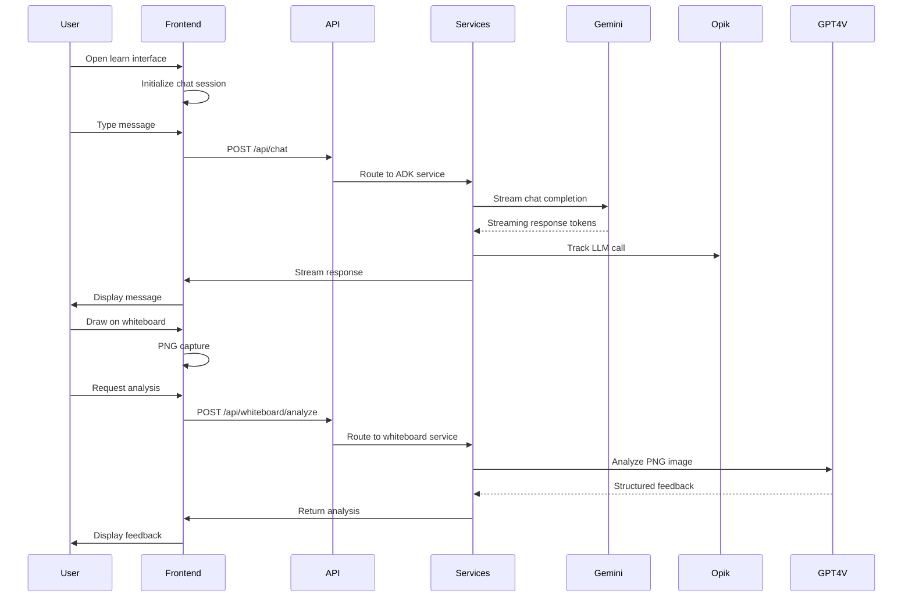
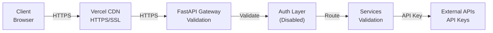

# Part 1: System Overview & Tech Stack

## Table of Contents
1. [High Level Architecture](#high-level-architecture)
2. [Tech Stack](#tech-stack)

---

## High Level Architecture

### System Overview

The Learn-With-AI platform is a sophisticated AI-powered learning system designed to help software engineers prepare for system design interviews. The architecture follows a client-server model with specialized AI services orchestrated through Google's Agent Development Kit (ADK).

#### Architecture Diagram



### Key Components

#### 1. **Frontend Layer** (NextJS 14)
- **Web Application**: React 18 with TypeScript (5,870 LOC)
- **Chat Interface**: Real-time messaging with streaming responses
- **Whiteboard Canvas**: HTML5 Canvas for system design drawings
- **Voice Interface**: Bidirectional audio streaming (future phase)
- **Progress Dashboard**: Timeline charts and analytics

#### 2. **API Gateway** (FastAPI + Uvicorn)
- Request validation and sanitization
- Security headers and CORS management
- Rate limiting (10 req/min per IP)
- Performance tracking middleware
- Monitoring/observability integration

#### 3. **Core Services** (17,761 LOC Python)
- **ADK Service**: Agent orchestration, conversation management
- **Whiteboard Service**: PNG analysis using multimodal LLMs
- **Assessment Service**: 6-dimensional evaluation engine
- **Progress Service**: Analytics and trend analysis
- **Diagram Service**: Mermaid diagram generation via MCP

#### 4. **AI/LLM Layer**
- **Gemini 2.0 Flash**: Primary conversation model via Google ADK
- **GPT-4o**: Multimodal whiteboard analysis
- **GPT-4 Turbo**: Assessment scoring and detailed feedback

#### 5. **Data Layer**
- **PostgreSQL**: User sessions, assessments, conversation history
- **Redis**: Rate limiting, caching, session management
- **Google Cloud Storage**: Artifact storage (disabled in MVP)

#### 6. **Monitoring & Observability**
- **Comet Opik**: LLM call tracking, cost monitoring, tracing
- **Custom Logging**: Structured JSON logs with sensitive data redaction
- **Health Checks**: System and service health endpoints

### Data Flow Diagram



### Service Boundaries

```
┌─────────────────────────────────────────────────────────┐
│                      Frontend Boundary                   │
│  (NextJS App - Deployed on Vercel)                       │
│  ├─ Chat Interface Component                             │
│  ├─ Whiteboard Canvas Component                          │
│  ├─ Voice Interface Component                            │
│  └─ Progress Dashboard Component                         │
└────────────────┬────────────────────────────────────────┘
                 │ HTTP/REST API
                 │
┌────────────────▼────────────────────────────────────────┐
│               FastAPI Gateway Boundary                   │
│  (Python - Deployed on Vercel Serverless)                │
│  ├─ Request Validation & Sanitization                    │
│  ├─ Authentication (Currently Disabled)                  │
│  ├─ Rate Limiting Middleware                             │
│  ├─ Security Headers Middleware                          │
│  └─ Performance Tracking Middleware                      │
└────────────────┬────────────────────────────────────────┘
                 │
┌────────────────▼────────────────────────────────────────┐
│            Core Services Boundary                        │
│  (Python Services - FastAPI Routes)                      │
│  ├─ ADK Service (Agent Orchestration)                    │
│  ├─ Whiteboard Service (Image Analysis)                  │
│  ├─ Assessment Service (Evaluation Engine)               │
│  ├─ Progress Service (Analytics)                         │
│  └─ Diagram Service (MCP Integration)                    │
└────────────────┬────────────────────────────────────────┘
                 │
      ┌──────────┴──────────┬─────────────┬──────────────┐
      │                     │             │              │
┌─────▼──────┐   ┌──────────▼──┐   ┌─────▼──┐   ┌──────▼──┐
│  PostgreSQL │   │    Redis    │   │ OpenAI │   │ Gemini  │
│  Database   │   │   Cache     │   │  APIs  │   │  APIs   │
└─────────────┘   └─────────────┘   └────────┘   └─────────┘
```

---

## Tech Stack

### Frontend Technology Stack

#### **Core Framework**
- **Next.js 14.0.0** - React 18 with server-side rendering and static generation
  - File-based routing system
  - API routes for serverless functions
  - Built-in CSS/Tailwind support
  - TypeScript support with strict mode
- **React 18.3.1** - UI component library
- **TypeScript 5.0** - Static type checking

#### **UI & Styling**
- **Tailwind CSS 3.0** - Utility-first CSS framework
  - ~2000+ utility classes
  - Dark mode support configured
  - Responsive design utilities
- **Shadcn UI** - Radix UI component collection
  - Button, Input, Textarea, Card
  - Tabs, Slider, ScrollArea
  - Avatar, Badge, Dialog
  - Pre-styled with Tailwind CSS
- **Lucide React** - Icon library (~400 icons)
- **Radix UI** - Unstyled, accessible components

#### **Content & Formatting**
- **react-markdown** - Markdown rendering
- **remark-gfm** - GitHub Flavored Markdown support
- **remark-math** - Mathematical notation support
- **rehype-highlight** - Code syntax highlighting

#### **Testing**
- **Jest** - Unit testing framework
- **React Testing Library** - Component testing utilities
- **Playwright** - E2E testing framework
  - Chromium, Firefox, WebKit browser support
  - Visual regression testing
  - Network interception

#### **Development Tools**
- **ESLint** - Code quality linting (ignored in builds)
- **Prettier** - Code formatting
- **npm** - Package management

#### **Frontend Architecture** [See Part 3 for details]
```
/frontend/
├── app/                    # NextJS App Router
│   ├── page.tsx           # Landing page
│   ├── chat/              # Chat interface
│   ├── chapters/          # Chapter selection
│   ├── progress/          # Progress dashboard
│   └── layout.tsx         # Root layout
├── components/            # React components
│   ├── ChatInterface.tsx      (850 LOC)
│   ├── WhiteboardCanvas.tsx   (845 LOC - needs refactoring)
│   ├── VoiceInterface.tsx     (620 LOC)
│   ├── AssessmentPanel.tsx    (480 LOC)
│   └── ProgressDashboard.tsx  (520 LOC)
├── hooks/                 # Custom React hooks
├── utils/                 # Utility functions
└── types/                 # TypeScript interfaces
```

---

### Backend Technology Stack

#### **Core Framework**
- **FastAPI 0.115.0+** - Modern Python web framework
  - Automatic API documentation (Swagger/OpenAPI)
  - Type hints integration
  - Async/await support
  - Dependency injection
- **Uvicorn 0.30.0+** - ASGI web server
  - HTTP/1.1 and HTTP/2 support
  - Connection pooling
  - Graceful shutdown

#### **Python Environment**
- **Python 3.11** - Primary language
  - Type hints support
  - Improved performance vs 3.10
  - Security patches
- **Pydantic 2.7.2+** - Data validation framework
  - Model validation
  - JSON schema generation
  - Serialization/deserialization

#### **AI & Agent Framework**
- **Google ADK 1.4.2+** - Agent Development Kit
  - LLM orchestration
  - Tool calling and integration
  - Session management with InMemorySessionService
  - Streaming support for real-time responses
  - Connection pooling (max 10 connections)
  - Health tracking for LiveRequestQueue
- **Google Genai 1.17.0+** - Google AI Python SDK
  - Gemini 2.0 Flash model access
  - Vertex AI integration option
  - File upload API for artifacts
- **OpenAI 1.0.0+** - OpenAI SDK
  - GPT-4o for multimodal analysis
  - GPT-4 Turbo for assessments
  - Vision API integration
  - Cost tracking

#### **Database & Storage**
- **SQLAlchemy 2.0** - ORM and database toolkit
  - Async support
  - Connection pooling (10 base, 20 overflow)
  - Query builder
  - Type hints integration
- **PostgreSQL** - Primary relational database
  - JSONB for session state and metadata
  - Full-text search capabilities
  - Connection pooling ready
- **Redis 5.0+** - In-memory data store
  - Rate limiting backend
  - Session caching
  - Message queue capability
- **Alembic** - Database migration tool (prepared but unused)

#### **Monitoring & Observability**
- **Comet Opik 0.2.0+** - LLM observability platform
  - Call tracking and metrics
  - Cost estimation
  - Latency monitoring
  - Trace/span creation
  - Project: "systemdesign-ai-production"
- **Psutil** - System monitoring
  - CPU usage tracking
  - Memory usage monitoring
  - Process metrics

#### **Security & Authentication**
- **PyJWT** - JWT token creation and validation
  - Token encoding/decoding
  - Algorithm support (HS256, RS256, etc.)
  - Token refresh mechanism (prepared)
- **Bcrypt** - Password hashing
  - Salt generation
  - Secure password storage
  - Comparison timing safety

#### **Testing & Quality**
- **Pytest** - Testing framework
  - >270 tests across multiple modules
  - Test fixtures and parameterization
  - Async test support
- **Pytest-asyncio** - Async test support
- **Pytest-cov** - Coverage reporting
  - Target: >90% code coverage
  - Coverage reports
- **Flake8** - Linting
  - PEP 8 compliance
  - Code quality checks
- **Black** - Code formatting
  - Automatic formatting
  - Consistent style enforcement
- **isort** - Import sorting
  - Organized imports
  - Group management
- **mypy** - Static type checking
  - Type hint validation
  - Return type checking
  - Module analysis

#### **Backend Architecture** [See Part 3 for details]
```
/backend/
├── app/
│   ├── main.py              # FastAPI app initialization
│   ├── api/                 # API route handlers
│   │   ├── chat.py
│   │   ├── assessment.py
│   │   ├── whiteboard.py
│   │   ├── diagrams.py
│   │   └── ... (8 routers)
│   ├── services/            # Business logic
│   │   ├── adk_service.py
│   │   ├── whiteboard_service.py
│   │   ├── assessment_service.py
│   │   ├── monitoring_service.py
│   │   └── ... (15+ services)
│   ├── models/              # Pydantic models
│   ├── database/            # SQLAlchemy models & setup
│   ├── middleware/          # FastAPI middleware
│   │   ├── security.py
│   │   ├── performance.py
│   │   └── monitoring.py
│   └── tools/               # ADK custom tools
├── tests/                   # Test suite (~270 tests)
└── requirements.txt         # Dependencies
```

---

### Infrastructure & Deployment

#### **Deployment Platform**
- **Vercel** - Serverless deployment platform
  - Frontend hosting (NextJS optimized)
  - Edge Functions for API
  - Serverless Python support via @vercel/python
  - Automatic SSL/TLS
  - CDN with global edge network
  - Environment variable management
  - Deployment previews

#### **External Services**
- **Google Cloud Platform**
  - Google ADK endpoints
  - Google Cloud Storage (optional, disabled in MVP)
  - Vertex AI (optional, for on-premise models)
- **OpenAI API**
  - GPT-4o for vision/multimodal
  - GPT-4 Turbo for assessments
  - Cost tracking
- **Comet Opik**
  - LLM monitoring dashboard
  - Call tracing and analytics
  - Cost estimation

#### **Monitoring Tools**
- **Custom Monitoring Service** - Internal metrics
  - System health checks
  - API request tracking
  - Error buffering
  - Performance metrics aggregation
- **Structured Logging** - JSON-based logging
  - Request ID tracking
  - Sensitive data redaction
  - Log rotation
  - Cloud logging integration

---

### Technology Decision Rationale

#### **Why Google ADK?**
- ✅ Specialized for multi-turn agent conversations
- ✅ Native tool calling and function integration
- ✅ Streaming support for real-time responses
- ✅ Built-in session management
- ✅ Direct integration with Gemini models

#### **Why FastAPI?**
- ✅ High performance (async/await native)
- ✅ Automatic OpenAPI documentation
- ✅ Type hints integration
- ✅ Built-in validation with Pydantic
- ✅ Low overhead for serverless deployment

#### **Why NextJS?**
- ✅ Server-side rendering for SEO
- ✅ Static generation for performance
- ✅ Built-in API routes
- ✅ Image optimization
- ✅ TypeScript support out-of-the-box

#### **Why Multi-Model LLM Approach?**
- **Gemini 2.0 Flash**: Fast, low-cost conversation (primary)
- **GPT-4o**: Superior multimodal capabilities for image analysis
- **GPT-4 Turbo**: Detailed reasoning for assessments
- Cost optimization through model specialization

#### **Why PostgreSQL + Redis?**
- **PostgreSQL**: ACID compliance, complex queries, data integrity
- **Redis**: Fast caching, rate limiting, session management
- Separation of concerns (transactional vs. cache)
- Production-proven reliability

---

### Tech Stack Summary Table

| Layer | Technology | Version | Purpose |
|-------|-----------|---------|---------|
| **Frontend** | Next.js | 14.0.0 | Framework |
| | React | 18.3.1 | UI library |
| | TypeScript | 5.0 | Type safety |
| | Tailwind CSS | 3.0 | Styling |
| | Shadcn UI | Latest | Components |
| **Backend** | FastAPI | 0.115.0+ | Framework |
| | Uvicorn | 0.30.0+ | Server |
| | Python | 3.11 | Language |
| | Pydantic | 2.7.2+ | Validation |
| **AI/ML** | Google ADK | 1.4.2+ | Agent |
| | Google Genai | 1.17.0+ | Gemini API |
| | OpenAI | 1.0.0+ | GPT models |
| **Data** | PostgreSQL | Latest | DB |
| | Redis | 5.0+ | Cache |
| | SQLAlchemy | 2.0 | ORM |
| **Monitoring** | Comet Opik | 0.2.0+ | LLM tracking |
| **Testing** | Pytest | Latest | Testing |
| | Playwright | Latest | E2E tests |
| | Jest | Latest | Unit tests |
| **Deployment** | Vercel | Latest | Hosting |

---

### Key Architecture Characteristics

#### **Scalability Features**
- Async/await for concurrent request handling
- Connection pooling (10-20 connections)
- Caching layer with Redis
- Stateless service design
- Serverless deployment for auto-scaling

#### **Reliability Features**
- Type safety with TypeScript and Pydantic
- Comprehensive error handling
- Rate limiting per endpoint
- Health check endpoints
- Monitoring and alerting

#### **Performance Features**
- Streaming responses for real-time feedback
- Caching strategy for repeated queries
- CDN via Vercel for static assets
- Optimized bundle size with tree-shaking
- Connection pooling and reuse

#### **Developer Experience**
- Automatic API documentation
- Type hints throughout
- Clear separation of concerns
- Comprehensive test coverage
- CI/CD automation

---

### Deployment Model

The system uses a **distributed deployment model**:

```
┌─────────────────┐         ┌──────────────────┐
│   Vercel Edge   │         │  Vercel Edge     │
│  (Frontend)     │         │  (Backend API)   │
└────────┬────────┘         └────────┬─────────┘
         │                           │
         └───────────┬───────────────┘
                     │
         ┌───────────┴───────────┐
         │                       │
      ┌──▼──┐            ┌──────▼──┐
      │ GCP │            │ OpenAI  │
      │(ADK)│            │ (GPT)   │
      └─────┘            └─────────┘
```

**Characteristics:**
- Frontend served from Vercel CDN globally
- Backend runs as serverless functions
- Direct API calls to external LLM services
- Stateless design for horizontal scaling
- Environment-based configuration

---

### Security Architecture (Current State)



**Security Measures:**
- ✅ HTTPS/TLS encryption in transit
- ✅ Input validation and sanitization
- ✅ Security headers (CSP, HSTS, X-Frame-Options)
- ✅ Rate limiting (10 req/min)
- ❌ **Authentication disabled** (critical gap)
- ⚠️ Weak secret management
- ⚠️ SQL injection vulnerabilities

---

### Cost Model Estimation

**Monthly Costs (at scale):**
- **API Calls**:
  - Gemini 2.0 Flash: ~$0.075/1M input, $0.30/1M output
  - GPT-4o: ~$0.005/1K tokens + $0.015/image
  - GPT-4 Turbo: ~$0.01/1K tokens
- **Infrastructure**:
  - Vercel Pro: $20/month
  - PostgreSQL: $15/month (Vercel Postgres)
  - Redis: $10/month (upstash)
- **Monitoring**: ~$30/month (Comet Opik)
- **Per User**: ~$0.25-0.80 (3-4 assessments)

---

### Conclusion

The Learn-With-AI platform uses a **modern, well-architected tech stack** optimized for:
- **AI Integration**: Google ADK + multi-model LLM approach
- **Performance**: Async backend, CDN-delivered frontend, streaming responses
- **Developer Experience**: Type safety, clear architecture, comprehensive testing
- **Scalability**: Serverless deployment, stateless services, caching

**Next Phase**: Security hardening and production deployment with PostgreSQL and Redis enabled.

