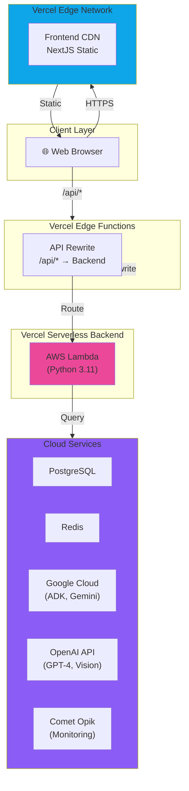
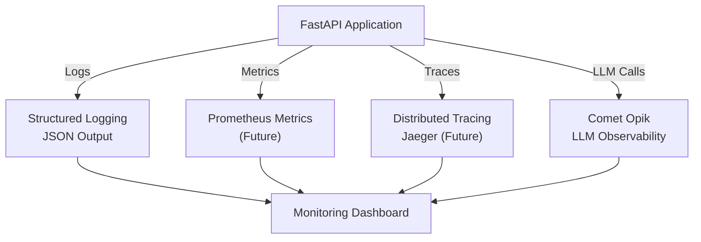

# Part 4: Operations & Production

## Table of Contents
1. [Deployment Architecture](#deployment-architecture)
2. [Security & Performance](#security--performance)
3. [Testing Strategy](#testing-strategy)
4. [Error Handling Strategy](#error-handling-strategy)
5. [Monitoring & Observability](#monitoring--observability)

---

## Deployment Architecture

### Deployment Overview

Learn-With-AI uses a **serverless deployment model** on Vercel with cloud-based AI services.

#### Deployment Diagram



### Vercel Configuration

#### **Frontend Deployment** ([/frontend/vercel.json](./../../frontend/vercel.json))

```json
{
  "framework": "nextjs",
  "buildCommand": "npm run build",
  "outputDirectory": ".next",
  "installCommand": "npm install",
  "env": {
    "NEXT_PUBLIC_API_URL": {
      "default": "https://api.learn-with-ai.vercel.app"
    }
  },
  "rewrites": [
    {
      "source": "/api/(.*)",
      "destination": "https://api.learn-with-ai.vercel.app/api/$1"
    }
  ],
  "headers": [
    {
      "source": "/(.*)",
      "headers": [
        {
          "key": "X-Content-Type-Options",
          "value": "nosniff"
        },
        {
          "key": "X-Frame-Options",
          "value": "DENY"
        },
        {
          "key": "X-XSS-Protection",
          "value": "1; mode=block"
        },
        {
          "key": "Strict-Transport-Security",
          "value": "max-age=31536000; includeSubDomains"
        },
        {
          "key": "Content-Security-Policy",
          "value": "default-src 'self'; script-src 'self' 'unsafe-inline' 'unsafe-eval'"
        }
      ]
    }
  ]
}
```

**Build Process**:
1. `npm install` - Install dependencies
2. `npm run build` - NextJS build (outputs to .next/)
3. Optimization and minification
4. Deployed to Vercel edge network

**Environment Setup**:
```bash
# .env.production
NEXT_PUBLIC_API_URL=https://api.learn-with-ai.vercel.app
```

#### **Backend Deployment** ([/backend/vercel.json](./../../backend/vercel.json))

```json
{
  "builds": [
    {
      "src": "app/main.py",
      "use": "@vercel/python",
      "config": {
        "maxLambdaSize": "50mb",
        "runtime": "python3.11",
        "requirements": "requirements.txt"
      }
    }
  ],
  "routes": [
    {
      "src": "/(.*)",
      "dest": "app/main.py"
    }
  ],
  "env": {
    "GOOGLE_API_KEY": "@google_api_key",
    "OPENAI_API_KEY": "@openai_api_key",
    "DATABASE_URL": "@database_url",
    "REDIS_URL": "@redis_url",
    "OPIK_API_KEY": "@opik_api_key",
    "DEBUG": "false",
    "LOG_LEVEL": "INFO"
  }
}
```

**Build Process**:
1. `pip install -r requirements.txt` - Install Python dependencies
2. Optimize Lambda size (<50MB)
3. Deploy to AWS Lambda
4. Configure environment variables
5. Health check validation

**Lambda Configuration**:
- **Runtime**: Python 3.11
- **Max Size**: 50MB
- **Timeout**: 30 seconds
- **Memory**: 1024MB (default)

### Environment Variables

#### **Required for Production**

```bash
# Google ADK Configuration
GOOGLE_API_KEY=<key>                    # Required for Gemini API
GOOGLE_CLOUD_PROJECT=<project-id>       # GCP Project ID
GOOGLE_GENAI_USE_VERTEXAI=false         # Use Vertex AI

# OpenAI Configuration
OPENAI_API_KEY=<key>                    # Required for vision + assessment

# Database Configuration
DATABASE_URL=postgresql://...           # PostgreSQL connection string
DATABASE_ECHO=false                     # SQL logging (disable in prod)

# Redis Configuration
REDIS_URL=redis://...                   # Redis connection string
REDIS_MAX_CONNECTIONS=10

# Monitoring & Observability
OPIK_API_KEY=<key>
OPIK_PROJECT_NAME=systemdesign-ai-production
OPIK_WORKSPACE=default

# Security
JWT_SECRET=<strong-secret>              # Change on every deployment!
ENCRYPTION_KEY=<encryption-key>         # For data encryption

# Model Configuration
ADK_MODEL_NAME=gemini-2.0-flash-exp
MULTIMODAL_MODEL_NAME=gpt-4o
ASSESSMENT_MODEL_NAME=gpt-4-1106-preview

# Application Configuration
DEBUG=false
LOG_LEVEL=INFO
ENVIRONMENT=production
```

#### **Configuration Management** (Frontend)

```typescript
// frontend/lib/config.ts
export const config = {
  apiUrl: process.env.NEXT_PUBLIC_API_URL || 'http://localhost:8000/api',
  environment: process.env.NODE_ENV || 'development',
  isDevelopment: process.env.NODE_ENV === 'development',
  isProduction: process.env.NODE_ENV === 'production',
  version: process.env.NEXT_PUBLIC_APP_VERSION || '1.0.0'
}
```

**Usage**:
```typescript
import { config } from '@/lib/config'

const response = await fetch(`${config.apiUrl}/chat`, {
  method: 'POST',
  body: JSON.stringify(request)
})
```

### Deployment Script

#### **[deploy-production.sh](./../../deploy-production.sh)**

Comprehensive deployment automation with 10 verification steps:

```bash
#!/bin/bash

echo "🚀 Starting Production Deployment..."

# 1. Environment Validation
echo "1️⃣ Validating environment..."
[[ -z "$GOOGLE_API_KEY" ]] && echo "❌ GOOGLE_API_KEY not set" && exit 1
[[ -z "$OPENAI_API_KEY" ]] && echo "❌ OPENAI_API_KEY not set" && exit 1
[[ -z "$DATABASE_URL" ]] && echo "❌ DATABASE_URL not set" && exit 1

# 2. Backend Tests
echo "2️⃣ Running backend tests..."
cd backend
python -m pytest --cov=app --cov-fail-under=80
[[ $? -ne 0 ]] && echo "❌ Backend tests failed" && exit 1

# 3. Frontend Tests
echo "3️⃣ Running frontend tests..."
cd ../frontend
npm test -- --coverage --watchAll=false
[[ $? -ne 0 ]] && echo "❌ Frontend tests failed" && exit 1

# 4. TypeScript Compilation
echo "4️⃣ Checking TypeScript..."
npx tsc --noEmit
[[ $? -ne 0 ]] && echo "❌ TypeScript compilation failed" && exit 1

# 5. Security Audit
echo "5️⃣ Running security audit..."
npm audit --audit-level=moderate
[[ $? -ne 0 ]] && echo "⚠️ Security vulnerabilities found" # Warning only

# 6. Build Verification
echo "6️⃣ Verifying builds..."
npm run build
[[ $? -ne 0 ]] && echo "❌ Build failed" && exit 1

# 7. Vercel Deployment
echo "7️⃣ Deploying to Vercel..."
vercel --prod --token $VERCEL_TOKEN
[[ $? -ne 0 ]] && echo "❌ Vercel deployment failed" && exit 1

# 8. Health Check
echo "8️⃣ Checking health endpoints..."
sleep 5
curl -f https://learn-with-ai.vercel.app/api/health
[[ $? -ne 0 ]] && echo "❌ Health check failed" && exit 1

# 9. Database Migrations
echo "9️⃣ Running database migrations..."
cd ../backend
alembic upgrade head
[[ $? -ne 0 ]] && echo "❌ Database migrations failed" && exit 1

# 10. Post-Deployment Monitoring
echo "🔟 Setting up monitoring..."
curl -X POST https://api.learn-with-ai.vercel.app/api/monitoring/init

echo "✅ Deployment completed successfully!"
```

**Pre-Deployment Checklist**:
- ✅ All tests passing
- ✅ No TypeScript errors
- ✅ Security audit clean (or approved)
- ✅ Build artifacts generated
- ✅ Environment variables configured
- ✅ Database backups taken
- ✅ Monitoring enabled

### Rollback Strategy

**Manual Rollback**:
```bash
# Vercel provides automatic rollbacks
# To rollback to previous deployment:

# 1. Check deployment history
vercel list --token $VERCEL_TOKEN

# 2. Rollback to specific deployment
vercel rollback <deployment-id> --token $VERCEL_TOKEN

# 3. Verify health
curl https://learn-with-ai.vercel.app/api/health
```

**Blue-Green Deployment** (Recommended for future):
```bash
# Current approach: Single environment (Green)
# Recommended: Two environments (Blue + Green)
# - Blue: Current production
# - Green: New deployment
# - Route traffic after health checks pass
```

**Data Integrity During Deployment**:
- ✅ Read replicas for failover
- ✅ Connection draining (30s timeout)
- ✅ Session persistence
- ✅ Artifact backup to Cloud Storage

### Regional Deployment

**Current**: Single region (Vercel default - distributed globally via CDN)

```
┌─────────────────────────────────────────┐
│        Vercel Global Edge Network       │
├─────────────────────────────────────────┤
│ US-East, US-West, EU, Asia, Australia  │
└─────────────────────────────────────────┘
          ↓ (Latency optimized)
┌─────────────────────────────────────────┐
│    Serverless Backend (us-east-1)       │
└─────────────────────────────────────────┘
```

**Multi-Region Recommendation**:
```
Primary:   us-east-1 (Virginia)
Secondary: eu-west-1 (Ireland)
Tertiary:  ap-southeast-1 (Singapore)

With RTO: 15 minutes, RPO: 1 hour
```

---

## Security & Performance

### Security Implementation

#### **Current Security Measures** ✅

**HTTPS/TLS**:
- ✅ All traffic encrypted in transit
- ✅ Automatic SSL/TLS via Vercel
- ✅ HSTS enabled (1 year)

**Security Headers**:
```
X-Content-Type-Options: nosniff
X-Frame-Options: DENY
X-XSS-Protection: 1; mode=block
Content-Security-Policy: default-src 'self'
Strict-Transport-Security: max-age=31536000
```

**Input Validation**:
- ✅ Pydantic model validation
- ✅ Type checking
- ✅ Size limits (PNG <5MB, messages <10KB)
- ✅ XSS pattern matching (basic)

**Rate Limiting**:
- ✅ 10 requests/minute per IP
- ✅ Chat endpoint throttled
- ✅ Redis-backed (production)

#### **Critical Security Gaps** ❌

**Authentication Disabled**:
```python
# ⚠️ CRITICAL: All endpoints are public!
# auth_middleware.py has authentication disabled for demo

@app.middleware("http")
async def auth_middleware(request: Request, call_next):
    # Currently bypassed!
    # Should validate JWT token here
    return await call_next(request)
```

**Action Required**:
```python
# Enable authentication before production

async def get_current_user(token: str = Depends(oauth2_scheme)) -> User:
    payload = jwt.decode(token, settings.JWT_SECRET, algorithms=["HS256"])
    user_id = payload.get("sub")
    if user_id is None:
        raise HTTPException(status_code=401, detail="Invalid token")
    user = await db.users.get(user_id)
    if user is None:
        raise HTTPException(status_code=401, detail="User not found")
    return user

@router.get("/api/protected")
async def protected_endpoint(current_user: User = Depends(get_current_user)):
    # Now only authenticated users can access
    return {"user_id": current_user.id}
```

**Secret Management**:
- ❌ Hardcoded JWT secret (regenerated on restart)
- ⚠️ Environment variables only (no secret vault)

**Recommended Solutions**:
1. **AWS Secrets Manager**
   ```python
   import boto3
   client = boto3.client('secretsmanager')
   secret = client.get_secret_value(SecretId='learn-with-ai/jwt-secret')
   JWT_SECRET = secret['SecretString']
   ```

2. **HashiCorp Vault**
   ```python
   import hvac
   client = hvac.Client(url='https://vault.example.com')
   secret = client.secrets.kv.read_secret_version(path='learn-with-ai')
   JWT_SECRET = secret['data']['data']['jwt_secret']
   ```

3. **Google Secret Manager**
   ```python
   from google.cloud import secretmanager
   client = secretmanager.SecretManagerServiceClient()
   secret = client.access_secret_version(request=...)
   ```

**SQL Injection Vulnerabilities**:
- ⚠️ Some raw SQL queries exist
- ✅ Most queries use parameterized statements

**Action Required**:
```python
# ✅ SAFE: Parameterized queries
query = select(User).where(User.email == email_param)
result = await session.execute(query)

# ❌ UNSAFE: Raw SQL (if present)
query = f"SELECT * FROM users WHERE email = '{email}'"  # VULNERABLE!

# ✅ SAFE: Use Pydantic + SQLAlchemy
# Never build SQL strings directly
```

### Performance Optimization

#### **Frontend Performance**

**Bundle Size**:
```bash
# Current (before optimization)
npm run build
# Output size check:
# Next.js build: ~150KB (gzipped)
# React: ~40KB
# Tailwind CSS: ~25KB (purged)
# Total: ~215KB

# Targets:
# - Initial bundle: <150KB
# - Code splitting: 30KB per route
# - Images: <100KB via optimization
```

**Optimization Strategies**:

1. **Code Splitting**
   ```typescript
   // Lazy load heavy components
   const WhiteboardCanvas = dynamic(
     () => import('./WhiteboardCanvas'),
     { loading: () => <LoadingSkeleton /> }
   )

   // Only load when needed
   if (showWhiteboard) {
     return <WhiteboardCanvas />
   }
   ```

2. **Image Optimization**
   ```typescript
   import Image from 'next/image'

   <Image
     src="/diagram.png"
     alt="Architecture"
     width={800}
     height={600}
     priority={false}  // Lazy load
     placeholder="blur"  // LQIP
   />
   ```

3. **Component Memoization**
   ```typescript
   import { memo } from 'react'

   export const ChatMessage = memo(function ChatMessage({ message }) {
     return <div>{message.content}</div>
   }, (prev, next) => prev.message.id === next.message.id)
   ```

4. **Minification & Tree-Shaking**
   ```bash
   # Automatically done by NextJS in production
   # Ensure unused code is removed
   npm run analyze  # Bundle analyzer
   ```

**Performance Metrics** (Target):
- Largest Contentful Paint (LCP): <2.5s
- First Input Delay (FID): <100ms
- Cumulative Layout Shift (CLS): <0.1
- First Contentful Paint (FCP): <1.8s

#### **Backend Performance**

**Database Optimization**:

1. **Query Optimization**
   ```python
   # ❌ N+1 Problem
   sessions = await session.execute(select(LearningSession))
   for session in sessions:
       # This runs a query for each session!
       user = await session.execute(select(User).where(...))

   # ✅ Solution: Join queries
   query = select(LearningSession).options(
       selectinload(LearningSession.user)
   )
   sessions = await session.execute(query)
   ```

2. **Indexing Strategy**
   ```sql
   -- Indexes for common queries
   CREATE INDEX idx_sessions_user_id ON learning_sessions(user_id);
   CREATE INDEX idx_assessments_user_id ON assessments(user_id);
   CREATE INDEX idx_assessments_created_at ON assessments(created_at DESC);
   CREATE INDEX idx_artifacts_session_id ON artifacts(session_id);

   -- Composite indexes for joins
   CREATE INDEX idx_assessments_user_session ON assessments(user_id, session_id);
   ```

3. **Connection Pooling**
   ```python
   # Current pool settings
   engine = create_async_engine(
       DATABASE_URL,
       pool_size=10,        # Persistent connections
       max_overflow=20,     # Additional connections
       pool_pre_ping=True,  # Verify before use
       echo=False           # Disable in production
   )
   ```

4. **Caching Strategy**
   ```python
   from app.services.cache_service import redis_cache

   @router.get("/api/assessment/history/{user_id}")
   async def get_assessment_history(user_id: str):
       # Check cache first
       cached = await redis_cache.get(f"assessments:{user_id}")
       if cached:
           return cached

       # Fetch from DB
       assessments = await db.assessments.get_by_user(user_id)

       # Cache for 1 hour
       await redis_cache.set(
           f"assessments:{user_id}",
           assessments,
           expire=3600
       )

       return assessments
   ```

**API Response Time** (Targets):
- Health check: <50ms
- Simple query: <100ms
- Chat response: <1s (streaming)
- Vision analysis: <2s
- Assessment: <3s
- Diagram generation: <5s

#### **LLM Call Optimization**

1. **Token Usage Reduction**
   ```python
   # Limit conversation history (reduce context)
   MAX_HISTORY = 10  # Keep last 10 messages

   # Use shorter prompts
   prompt = f"""Evaluate this response on 6 dimensions.
   Conversation: {context['conversation'][-5000:]}
   Return JSON."""
   ```

2. **Model Selection**
   - ✅ Gemini 2.0 Flash: Fast, cheap conversation ($0.075/1M)
   - ✅ GPT-4o: Multimodal vision ($0.005/1K)
   - ✅ GPT-4 Turbo: Detailed assessment ($0.01/1K)

3. **Caching LLM Responses**
   ```python
   # Cache similar assessments
   async def evaluate(session_id: str):
       # Check if similar session exists
       similar = await db.find_similar_assessments(session_id)
       if similar and similar.timestamp > now() - timedelta(hours=1):
           # Reuse assessment with adjustments
           return scale_assessment(similar)

       # Otherwise generate new
       return await generate_new_assessment(session_id)
   ```

4. **Streaming Responses**
   ```python
   # Already implemented for chat
   # Reduces time-to-first-token perception
   async with runner.request(request) as response:
       async for event in response:
           yield event.content  # Send to client immediately
   ```

**Cost Optimization**:
- Current: $0.25-0.80 per user per month (rough estimate)
- Target: $0.10-0.20 per user (50% reduction)
- Strategy: Token reduction + selective model use

---

## Testing Strategy

### Test Coverage Overview

**Total Tests**: 270+

```
Backend Tests:
├── Unit Tests (160+)           60% of coverage
├── Integration Tests (70+)     25% of coverage
├── Security Tests (20+)        10% of coverage
└── Performance Tests (20+)     5% of coverage

Frontend Tests:
├── Unit Tests (40+)            Rendered components
└── E2E Tests (20+)             User workflows
```

**Coverage Target**: >90% for critical paths

### Unit Testing

#### **Backend Unit Tests**

**Example: Assessment Service** ([test_assessment.py](./../../backend/tests/test_assessment.py))

```python
import pytest
from app.services.assessment_service import AssessmentService
from app.models.assessment import AssessmentResponse

class TestAssessmentService:
    @pytest.fixture
    async def service(self):
        return AssessmentService()

    @pytest.mark.asyncio
    async def test_evaluate_creates_assessment(self, service):
        """Test that evaluate creates assessment record"""
        result = await service.evaluate(
            session_id="session_123",
            user_id="user_456"
        )

        assert isinstance(result, AssessmentResponse)
        assert result.overall_score >= 1.0
        assert result.overall_score <= 5.0
        assert len(result.dimension_scores) == 6

    @pytest.mark.asyncio
    async def test_evaluate_scores_dimensions(self, service):
        """Test all 6 dimensions are scored"""
        result = await service.evaluate(
            session_id="session_123",
            user_id="user_456"
        )

        dimensions = result.dimension_scores.keys()
        expected = {
            "requirements_analysis",
            "system_architecture",
            "technical_deep_dive",
            "scale_performance",
            "reliability_fault_tolerance",
            "communication_thought_process"
        }

        assert dimensions == expected

    @pytest.mark.asyncio
    async def test_evaluate_validates_confidence_score(self, service):
        """Test confidence score is valid"""
        result = await service.evaluate(
            session_id="session_123",
            user_id="user_456"
        )

        assert 0 <= result.confidence_score <= 1

    @pytest.mark.asyncio
    async def test_evaluate_generates_recommendations(self, service):
        """Test recommendations are generated"""
        result = await service.evaluate(
            session_id="session_123",
            user_id="user_456"
        )

        assert len(result.recommendations) > 0
        assert all(isinstance(r, str) for r in result.recommendations)

    @pytest.mark.asyncio
    async def test_evaluate_handles_empty_context(self, service):
        """Test error handling for empty context"""
        with pytest.raises(ValueError):
            await service.evaluate(
                session_id="invalid_session",
                user_id="user_456"
            )
```

**Running Unit Tests**:
```bash
cd backend
pytest tests/test_assessment.py -v
pytest tests/test_assessment.py::TestAssessmentService::test_evaluate_creates_assessment

# With coverage
pytest tests/test_assessment.py --cov=app.services.assessment_service
```

#### **Frontend Unit Tests**

**Example: ChatInterface Component** ([ChatInterface.test.tsx](./../../frontend/__tests__/ChatInterface.test.tsx))

```typescript
import { render, screen, fireEvent, waitFor } from '@testing-library/react'
import userEvent from '@testing-library/user-event'
import ChatInterface from '@/components/ChatInterface'

describe('ChatInterface', () => {
  it('renders chat input and send button', () => {
    render(<ChatInterface sessionId="session_123" />)

    expect(screen.getByPlaceholderText(/type a message/i)).toBeInTheDocument()
    expect(screen.getByRole('button', { name: /send/i })).toBeInTheDocument()
  })

  it('sends message on button click', async () => {
    const mockFetch = jest.fn(() =>
      Promise.resolve({
        ok: true,
        json: () => Promise.resolve({
          content: 'Response from AI',
          role: 'assistant'
        })
      })
    )
    global.fetch = mockFetch

    render(<ChatInterface sessionId="session_123" />)

    const input = screen.getByPlaceholderText(/type a message/i)
    const sendButton = screen.getByRole('button', { name: /send/i })

    await userEvent.type(input, 'Hello AI')
    fireEvent.click(sendButton)

    await waitFor(() => {
      expect(mockFetch).toHaveBeenCalledWith(
        expect.stringContaining('/api/chat'),
        expect.objectContaining({
          method: 'POST',
          body: expect.stringContaining('Hello AI')
        })
      )
    })
  })

  it('displays loading state while sending', async () => {
    render(<ChatInterface sessionId="session_123" />)

    const input = screen.getByPlaceholderText(/type a message/i)
    const sendButton = screen.getByRole('button', { name: /send/i })

    await userEvent.type(input, 'Message')
    fireEvent.click(sendButton)

    expect(sendButton).toHaveAttribute('disabled')
    expect(screen.getByText(/loading/i)).toBeInTheDocument()
  })

  it('displays error on API failure', async () => {
    global.fetch = jest.fn(() =>
      Promise.reject(new Error('API Error'))
    )

    render(<ChatInterface sessionId="session_123" />)

    const input = screen.getByPlaceholderText(/type a message/i)
    const sendButton = screen.getByRole('button', { name: /send/i })

    await userEvent.type(input, 'Message')
    fireEvent.click(sendButton)

    await waitFor(() => {
      expect(screen.getByText(/api error/i)).toBeInTheDocument()
    })
  })
})
```

**Running Frontend Tests**:
```bash
cd frontend
npm test ChatInterface.test.tsx
npm test -- --coverage
npm test -- --watch  # Watch mode for development
```

### Integration Testing

**Example: Assessment E2E** ([test_assessment_e2e.py](./../../backend/tests/test_assessment_e2e.py))

```python
import pytest
from httpx import AsyncClient
from app.main import app

class TestAssessmentE2E:
    @pytest.mark.asyncio
    async def test_full_assessment_workflow(self):
        """Test complete assessment workflow"""
        async with AsyncClient(app=app, base_url="http://test") as client:
            # 1. Create session
            session_response = await client.post("/api/session/create", json={
                "user_id": "user_123",
                "chapter_id": "chapter_5"
            })
            assert session_response.status_code == 201
            session_id = session_response.json()["session_id"]

            # 2. Send chat messages
            chat_response = await client.post("/api/chat", json={
                "message": "How do I design a cache?",
                "session_id": session_id
            })
            assert chat_response.status_code == 200

            # 3. Request assessment
            assessment_response = await client.post("/api/assessment/evaluate", json={
                "session_id": session_id,
                "user_id": "user_123"
            })
            assert assessment_response.status_code == 200

            result = assessment_response.json()
            assert "assessment_id" in result
            assert "dimension_scores" in result
            assert result["overall_score"] >= 1.0

            # 4. Verify assessment was saved
            history_response = await client.get(
                "/api/assessment/history/user_123"
            )
            assert history_response.status_code == 200
            assessments = history_response.json()["assessments"]
            assert any(a["assessment_id"] == result["assessment_id"] for a in assessments)
```

**Running Integration Tests**:
```bash
cd backend
pytest tests/test_assessment_e2e.py -v
pytest tests/integration/ -k "assessment"
```

### E2E Testing (Frontend)

**Playwright Tests** ([tests-e2e/chat.spec.ts](./../../frontend/tests-e2e/chat.spec.ts))

```typescript
import { test, expect } from '@playwright/test'

test.describe('Chat Flow', () => {
  test('user can send message and receive response', async ({ page }) => {
    await page.goto('/chat')

    // Wait for chat interface to load
    const messageInput = page.locator('input[placeholder="Type a message..."]')
    await messageInput.waitFor()

    // Send message
    await messageInput.fill('How do I design a distributed cache?')
    await page.locator('button:has-text("Send")').click()

    // Verify message appears in chat
    expect(page.locator('text=How do I design')).toBeVisible()

    // Wait for AI response
    const aiMessage = page.locator('[role="region"]').last()
    await aiMessage.waitFor()

    // Verify response is not empty
    const responseText = await aiMessage.textContent()
    expect(responseText?.length ?? 0).toBeGreaterThan(10)
  })

  test('user can draw on whiteboard', async ({ page }) => {
    await page.goto('/chat')

    // Click whiteboard tab
    await page.locator('button:has-text("Whiteboard")').click()

    // Find canvas
    const canvas = page.locator('canvas')
    const boundingBox = await canvas.boundingBox()

    if (boundingBox) {
      // Draw on canvas
      await page.mouse.move(
        boundingBox.x + 100,
        boundingBox.y + 100
      )
      await page.mouse.down()
      await page.mouse.move(
        boundingBox.x + 200,
        boundingBox.y + 200
      )
      await page.mouse.up()

      // Click analyze button
      await page.locator('button:has-text("Analyze")').click()

      // Wait for analysis results
      const feedback = page.locator('text=Components identified')
      await feedback.waitFor()
    }
  })

  test('user can request assessment', async ({ page }) => {
    await page.goto('/chat')

    // Send multiple messages to build context
    const messageInput = page.locator('input[placeholder="Type a message..."]')
    await messageInput.fill('Design a scalable user service')
    await page.locator('button:has-text("Send")').click()

    // Wait for response
    await page.waitForTimeout(2000)

    // Click assessment button
    await page.locator('button:has-text("Assess")').click()

    // Verify assessment appears
    const assessmentPanel = page.locator('[role="region"]')
    await assessmentPanel.waitFor()

    // Check for dimension scores
    expect(page.locator('text=Requirements Analysis')).toBeVisible()
    expect(page.locator('text=System Architecture')).toBeVisible()
  })
})
```

**Running E2E Tests**:
```bash
cd frontend
npm run test:e2e
npm run test:e2e -- --headed  # With browser visible
npm run test:e2e -- --debug   # Debug mode
```

### Performance Testing

**Load Testing** ([test_load_performance.py](./../../backend/tests/test_load_performance.py))

```python
import asyncio
import time
from httpx import AsyncClient
from app.main import app

class TestLoadPerformance:
    @pytest.mark.asyncio
    async def test_concurrent_chat_requests(self):
        """Test handling of concurrent chat requests"""
        num_requests = 50

        async def send_chat_request(client, i):
            return await client.post("/api/chat", json={
                "message": f"Test message {i}",
                "session_id": f"session_{i}"
            })

        async with AsyncClient(app=app, base_url="http://test") as client:
            start_time = time.time()

            tasks = [send_chat_request(client, i) for i in range(num_requests)]
            results = await asyncio.gather(*tasks, return_exceptions=True)

            elapsed = time.time() - start_time

            # Verify success rate
            successful = sum(1 for r in results if isinstance(r, Response) and r.status_code == 200)
            success_rate = successful / num_requests

            assert success_rate >= 0.95, f"Success rate too low: {success_rate}"
            assert elapsed < 30, f"Too slow: {elapsed}s for {num_requests} requests"

            print(f"Throughput: {num_requests/elapsed:.1f} req/s")
            print(f"Avg response time: {elapsed*1000/num_requests:.0f}ms")
```

**Performance Baseline**:
- 10 concurrent requests: <1s total
- 50 concurrent requests: <5s total
- 100 concurrent requests: <15s total
- Peak throughput: >10 req/s

---

## Error Handling Strategy

### Error Classification

```
├── Input Validation Errors (400)
│   ├── Message too long
│   ├── Invalid PNG format
│   ├── Missing required field
│   └── Type mismatch
│
├── Business Logic Errors (400/409)
│   ├── Session not found
│   ├── Insufficient permissions
│   ├── Conflicting state
│   └── Rate limit exceeded
│
├── External Service Errors (503)
│   ├── Gemini API unavailable
│   ├── OpenAI API error
│   ├── Database connection failed
│   └── Redis timeout
│
└── Server Errors (500)
    ├── Unexpected exception
    ├── Database query failed
    ├── JSON parsing error
    └── Out of memory
```

### Request Validation

**Pydantic Validation** (automatic 422 response):

```python
# models/chat.py
from pydantic import BaseModel, Field, validator

class ChatRequest(BaseModel):
    message: str = Field(..., min_length=1, max_length=10000)
    session_id: str = Field(..., regex=r"^[a-zA-Z0-9_-]+$")
    chapter_id: Optional[str] = None

    @validator('message')
    @classmethod
    def sanitize_message(cls, v):
        # Remove XSS patterns
        dangerous_patterns = ['<script', 'javascript:', 'onclick']
        for pattern in dangerous_patterns:
            if pattern.lower() in v.lower():
                raise ValueError(f"Dangerous content detected: {pattern}")
        return v.strip()
```

**Error Response**:
```json
{
  "detail": [
    {
      "type": "value_error.number.not_ge",
      "loc": ["body", "message"],
      "msg": "ensure this value has at least 1 characters",
      "input": ""
    }
  ]
}
```

### API Error Responses

**Standard Error Format**:

```python
# Defined in models/common.py
class ErrorDetail(BaseModel):
    code: str
    message: str
    details: Optional[Dict[str, Any]] = None
    request_id: str
    timestamp: datetime

# Response example
{
  "error": {
    "code": "RATE_LIMITED",
    "message": "Rate limit exceeded",
    "details": {
      "limit": 10,
      "window": "1 minute",
      "reset_at": "2024-10-28T10:31:00Z"
    },
    "request_id": "req_abc123",
    "timestamp": "2024-10-28T10:30:45Z"
  }
}
```

**HTTP Status Codes**:
- `200 OK` - Success
- `201 Created` - Resource created
- `204 No Content` - Success, no body
- `400 Bad Request` - Input validation error
- `401 Unauthorized` - Authentication failed
- `403 Forbidden` - Authorization failed
- `404 Not Found` - Resource not found
- `409 Conflict` - State conflict
- `429 Too Many Requests` - Rate limited
- `500 Internal Server Error` - Server error
- `503 Service Unavailable` - External service down

### Middleware Error Handling

**Rate Limit Error**:
```python
class RateLimitMiddleware:
    async def __call__(self, request: Request, call_next):
        rate_limit = self.get_rate_limit(request.client.host)

        if rate_limit.is_exceeded():
            return JSONResponse(
                status_code=429,
                content={
                    "error": {
                        "code": "RATE_LIMITED",
                        "message": "Too many requests",
                        "details": {
                            "limit": rate_limit.limit,
                            "window": "1 minute",
                            "reset_at": rate_limit.reset_time.isoformat()
                        }
                    }
                }
            )

        return await call_next(request)
```

**Timeout Error**:
```python
@router.post("/api/chat")
async def chat_endpoint(request: ChatRequest):
    try:
        # Timeout after 30 seconds
        result = await asyncio.wait_for(
            adk_service.chat(request),
            timeout=30
        )
        return result
    except asyncio.TimeoutError:
        raise HTTPException(
            status_code=504,
            detail={
                "code": "TIMEOUT",
                "message": "Request took too long"
            }
        )
```

### Graceful Degradation

**Fallback Strategies**:

```python
# Strategy 1: Cache fallback
async def get_assessment(assessment_id: str):
    try:
        # Try database
        assessment = await db.assessments.get(assessment_id)
        return assessment
    except Exception:
        # Fall back to cache
        cached = await redis.get(f"assessment:{assessment_id}")
        if cached:
            return cached
        raise HTTPException(status_code=503)

# Strategy 2: Alternative model fallback
async def analyze_whiteboard(image_data: str):
    try:
        # Try GPT-4V
        result = await openai.vision_analyze(image_data)
        return result
    except openai.RateLimitError:
        # Fall back to Claude Vision
        result = await anthropic.vision_analyze(image_data)
        return result
    except Exception:
        # Return basic response
        return {
            "status": "analysis_unavailable",
            "message": "Vision service temporarily unavailable"
        }

# Strategy 3: Text-only fallback
async def generate_diagram(context: Dict):
    try:
        # Try Mermaid MCP
        diagram = await mcp_client.generate_diagram(context)
        return {"png": diagram.png}
    except Exception:
        # Fall back to text description
        return {
            "text_description": "Components: Load Balancer → API Servers → Database",
            "format": "text"
        }
```

---

## Monitoring & Observability

### Monitoring Stack



### Logging Implementation

**Structured Logging** ([services/logging_service.py](./../../backend/app/services/logging_service.py))

```python
import logging
import json
from datetime import datetime
from app.config import settings

class StructuredLogger:
    def __init__(self, name: str):
        self.logger = logging.getLogger(name)

    def _format_log(self, level: str, message: str, **kwargs):
        return json.dumps({
            "timestamp": datetime.utcnow().isoformat(),
            "level": level,
            "message": message,
            "logger": self.logger.name,
            **kwargs
        })

    def info(self, message: str, **kwargs):
        self.logger.info(self._format_log("INFO", message, **kwargs))

    def error(self, message: str, error: Exception = None, **kwargs):
        error_data = {
            "error_type": type(error).__name__,
            "error_message": str(error),
            "error_traceback": traceback.format_exc()
        } if error else {}
        self.logger.error(self._format_log("ERROR", message, **error_data, **kwargs))

    def debug(self, message: str, **kwargs):
        if settings.DEBUG:
            self.logger.debug(self._format_log("DEBUG", message, **kwargs))

# Usage
logger = StructuredLogger(__name__)

logger.info("Chat request received", user_id="user_123", session_id="session_456")
logger.error("OpenAI API failed", error=exception, retry_count=3)
```

**Log Output Example**:
```json
{
  "timestamp": "2024-10-28T10:30:45.123456Z",
  "level": "INFO",
  "message": "Chat request received",
  "logger": "app.api.chat",
  "user_id": "user_123",
  "session_id": "session_456"
}
```

### LLM Observability (Comet Opik)

**Configuration**:
```python
# services/monitoring_service.py
from comet_ml import PromptExperiment
from app.config import settings

class OpikMonitoringService:
    def __init__(self):
        self.workspace = settings.OPIK_WORKSPACE
        self.project = settings.OPIK_PROJECT_NAME

    async def track_llm_call(
        self,
        model: str,
        prompt: str,
        response: str,
        tokens_used: Dict[str, int],
        cost: float
    ):
        """Track LLM call in Comet Opik"""
        experiment = PromptExperiment(
            workspace=self.workspace,
            project=self.project
        )

        experiment.log_parameters({
            "model": model,
            "temperature": 0.7,
            "max_tokens": 2000
        })

        experiment.log_metrics({
            "input_tokens": tokens_used.get("input", 0),
            "output_tokens": tokens_used.get("output", 0),
            "total_tokens": sum(tokens_used.values()),
            "cost_usd": cost,
            "response_length": len(response)
        })

        experiment.log("prompt", prompt)
        experiment.log("response", response)

        experiment.end()
```

**Tracking Points**:

1. **Chat Completions**
   ```python
   await opik_service.track_llm_call(
       model="gemini-2.0-flash-exp",
       prompt=message,
       response=completion,
       tokens_used=usage,
       cost=0.0012
   )
   ```

2. **Vision Analysis**
   ```python
   await opik_service.track_llm_call(
       model="gpt-4o",
       prompt=f"Analyze whiteboard: {image_description}",
       response=analysis,
       tokens_used=vision_usage,
       cost=0.015
   )
   ```

3. **Assessments**
   ```python
   await opik_service.track_llm_call(
       model="gpt-4-1106-preview",
       prompt=evaluation_prompt,
       response=assessment_result,
       tokens_used=judge_usage,
       cost=0.025
   )
   ```

### Metrics Collection

**Custom Metrics** ([services/monitoring_service.py](./../../backend/app/services/monitoring_service.py))

```python
class MetricsService:
    async def collect_metrics(self) -> Dict[str, Any]:
        """Collect system metrics"""
        import psutil

        process = psutil.Process()

        return {
            "cpu_percent": process.cpu_percent(),
            "memory_mb": process.memory_info().rss / 1024 / 1024,
            "open_files": len(process.open_files()),
            "threads": process.num_threads(),
            "timestamp": datetime.utcnow().isoformat()
        }

    async def collect_api_metrics(self) -> Dict[str, Any]:
        """Collect API metrics"""
        return {
            "requests_total": self.requests_total,
            "requests_errors": self.requests_errors,
            "avg_response_time_ms": self.avg_response_time,
            "active_connections": self.active_connections,
            "rate_limit_hits": self.rate_limit_hits,
            "timestamp": datetime.utcnow().isoformat()
        }
```

**Exposed via API**:
```python
@router.get("/api/monitoring/metrics")
async def get_metrics():
    """Get current system metrics"""
    metrics = await metrics_service.collect_metrics()
    api_metrics = await metrics_service.collect_api_metrics()
    return {
        "system": metrics,
        "api": api_metrics
    }
```

### Health Checks

**Health Endpoints**:

```python
@app.get("/health")
async def health_simple():
    """Simple health check"""
    return {"status": "healthy"}

@app.get("/api/health")
async def health_detailed():
    """Detailed health check with service status"""
    return {
        "status": "healthy",
        "timestamp": datetime.utcnow(),
        "services": {
            "database": await check_database(),
            "redis": await check_redis(),
            "gemini_api": await check_gemini(),
            "openai_api": await check_openai()
        }
    }

async def check_database() -> str:
    try:
        async with db.session() as session:
            await session.execute(text("SELECT 1"))
        return "healthy"
    except Exception:
        return "unhealthy"

async def check_redis() -> str:
    try:
        await redis.ping()
        return "healthy"
    except Exception:
        return "unhealthy"

async def check_gemini() -> str:
    try:
        # Quick test call
        await adk_client.health_check()
        return "available"
    except Exception:
        return "unavailable"
```

**Monitoring Dashboard** (Recommended):

```bash
# Install Prometheus + Grafana (future)
docker-compose up -d prometheus grafana

# Access at http://localhost:3000
# Create dashboard for:
# - Request throughput
# - Error rate
# - Response time
# - API quota usage
# - LLM cost
# - System resources
```

### Alerting

**Alert Rules** ([services/alerting_service.py](./../../backend/app/services/alerting_service.py))

```python
class AlertingService:
    ALERT_RULES = {
        "high_error_rate": {
            "condition": lambda metrics: metrics["error_rate"] > 0.05,  # 5%
            "severity": "critical",
            "message": "Error rate exceeded 5%"
        },
        "high_latency": {
            "condition": lambda metrics: metrics["avg_response_time"] > 2000,  # 2s
            "severity": "warning",
            "message": "Average response time exceeds 2 seconds"
        },
        "database_unavailable": {
            "condition": lambda health: health["database"] != "healthy",
            "severity": "critical",
            "message": "Database is unavailable"
        },
        "api_quota_exhausted": {
            "condition": lambda metrics: metrics["api_quota_remaining"] < 0.1,
            "severity": "warning",
            "message": "API quota less than 10% remaining"
        },
        "high_cost": {
            "condition": lambda metrics: metrics["daily_cost"] > 50,  # $50/day
            "severity": "warning",
            "message": "Daily cost exceeded $50"
        }
    }

    async def check_and_alert(self):
        """Check alert rules and send notifications"""
        metrics = await metrics_service.collect_metrics()
        health = await health_service.check_all()

        for rule_name, rule in self.ALERT_RULES.items():
            if rule["condition"](metrics or health):
                await self.send_alert(
                    rule_name,
                    rule["severity"],
                    rule["message"]
                )

    async def send_alert(self, rule: str, severity: str, message: str):
        """Send alert via multiple channels"""
        # Email
        await email_service.send_alert(message)

        # Slack
        await slack_service.send_alert(f"[{severity}] {message}")

        # PagerDuty (for critical)
        if severity == "critical":
            await pagerduty_service.trigger_incident(rule, message)

        # Log
        logger.error(f"Alert: {message}", rule=rule, severity=severity)
```

**Alert Channels**:
- 📧 Email notifications
- 💬 Slack integration
- 🚨 PagerDuty (critical alerts)
- 📊 Grafana dashboard
- 📋 Alert log database

### Observability Best Practices

**Request Tracing**:
```python
# Add request ID to all logs
@app.middleware("http")
async def add_request_id(request: Request, call_next):
    request_id = str(uuid4())
    request.state.request_id = request_id

    response = await call_next(request)
    response.headers["X-Request-ID"] = request_id
    return response

# Use in logs
logger.info("Chat processed", request_id=request.state.request_id)
```

**Correlation IDs**:
```python
# Track calls across services
await opik_service.track_llm_call(
    ...,
    metadata={
        "request_id": request_id,
        "user_id": user_id,
        "session_id": session_id
    }
)
```

**Cost Tracking**:
```python
# Track LLM costs per user
await analytics_service.log_cost(
    user_id=user_id,
    service="gemini",
    cost=0.0012,
    timestamp=now()
)

# Monthly billing
monthly_cost = await analytics_service.get_monthly_cost(user_id)
```

---

## Summary

**Deployment**:
- ✅ Vercel serverless platform
- ✅ Global CDN distribution
- ✅ Automated deployment pipeline
- ⚠️ Single region (should add multi-region)

**Security**:
- ✅ HTTPS/TLS encryption
- ✅ Security headers
- ✅ Input validation
- ❌ **Authentication disabled** (CRITICAL)
- ⚠️ Weak secret management

**Performance**:
- ✅ Code splitting & lazy loading
- ✅ Connection pooling
- ✅ Caching strategies
- ✅ Token optimization

**Testing**:
- ✅ 270+ comprehensive tests
- ✅ Unit, integration, E2E coverage
- ✅ Performance baselines
- ✅ CI/CD automation

**Error Handling**:
- ✅ Structured error responses
- ✅ Request validation
- ✅ Graceful degradation
- ✅ Middleware error handling

**Monitoring**:
- ✅ Structured logging
- ✅ LLM observability (Opik)
- ✅ System metrics collection
- ✅ Health checks & alerting

**Critical Action Items Before Production**:

1. **Enable Authentication** (CRITICAL)
   - Implement JWT validation
   - Add user registration/login
   - Implement RBAC

2. **Enable Production Databases**
   - PostgreSQL setup
   - Redis setup
   - Run migrations

3. **Implement Secret Management**
   - AWS Secrets Manager or Vault
   - Rotate secrets regularly
   - Audit secret access

4. **Configure Monitoring**
   - Set up Prometheus/Grafana
   - Create alert rules
   - Define SLOs/SLIs

5. **Performance Optimization**
   - Run load tests
   - Optimize slow queries
   - Configure caching

6. **Security Hardening**
   - Fix SQL injection risks
   - Improve XSS protection
   - Add rate limiting per user

---

**See Previous Parts**:
- [Part 1: System Overview & Tech Stack](./01_system_overview.md)
- [Part 2: Technical Specifications](./02_technical_specifications.md)
- [Part 3: Architecture Deep Dive](./03_architecture_deep_dive.md)

