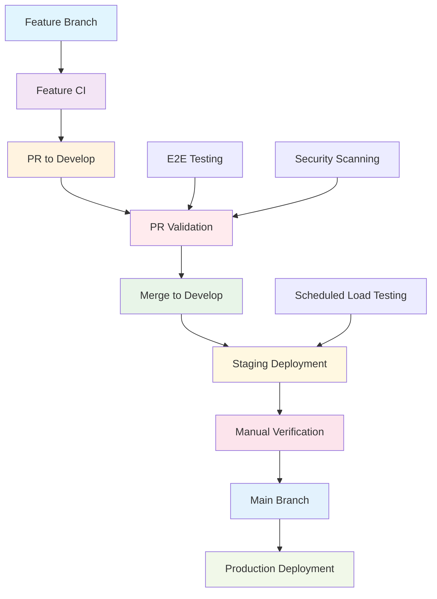

# Production-Grade CI/CD Workflows

This document describes the comprehensive CI/CD pipeline implemented for the AI System Design Learning Platform, designed for fast development cycles and production-grade reliability.

## 🏗️ Workflow Architecture Overview



## 📋 Workflow Matrix

| Workflow | Trigger | Duration | Purpose | Test Coverage |
|----------|---------|----------|---------|---------------|
| **Feature CI** | Push to feature branch | < 5 min | Fast feedback | Linting, Unit tests, Type checking |
| **PR Validation** | PR to develop | < 15 min | Comprehensive validation | Integration, E2E, Security |
| **Staging Deploy** | Merge to develop | < 20 min | Staging validation | Full integration, Manual verification |
| **E2E Testing** | On-demand/Reusable | < 30 min | User journey validation | Puppeteer MCP integration |
| **Load Testing** | Scheduled/On-demand | < 30 min | Performance validation | K6, Resource monitoring |
| **Production Deploy** | Manual trigger | < 25 min | Production release | Health checks, Rollback capability |

## 🚀 Workflow Details

### 1. Feature Branch CI (feature-ci.yml)

**Purpose:** Provide immediate feedback on feature development
**Trigger:** Push to any branch except `main` and `develop`
**Duration:** < 5 minutes
**Philosophy:** Fail fast, fix fast

#### Jobs:
1. **Quick Checks (< 1 min)**
   - Frontend: ESLint, TypeScript compilation
   - Backend: Flake8, MyPy, Black formatting
   - Parallel execution for speed

2. **Unit Tests (< 3 min)**
   - Matrix strategy: `[frontend, backend]`
   - Coverage reporting
   - Fail-fast on critical failures

3. **API Contract Tests (< 1 min)**
   - Lightweight integration validation
   - FastAPI endpoint structure verification
   - Basic contract compliance

4. **Build Verification**
   - Frontend: Next.js build
   - Backend: Import validation
   - Ensures deployability

#### Configuration:
```yaml
env:
  FAIL_FAST: true  # Stop on first critical failure
strategy:
  fail-fast: true
timeout-minutes: 5  # Quick feedback requirement
```

### 2. PR Validation (pr-validation.yml)

**Purpose:** Comprehensive testing before merge to develop
**Trigger:** Pull request to `develop` branch
**Duration:** < 15 minutes
**Philosophy:** Thorough validation with toggleable test suites

#### Jobs:
1. **Feature CI Re-verification**
   - Ensures consistency across environments
   - Validates no regression since feature branch

2. **Claude Code Review** (Parallel)
   - Automated code quality analysis
   - Security and performance insights
   - Posted as PR comments

3. **Deploy Preview Environment**
   - Ephemeral Vercel deployments
   - Frontend + Backend preview URLs
   - GitHub deployment tracking

4. **Integration Tests** (Conditional)
   - Full-stack integration validation
   - Database integration tests
   - API integration verification

5. **E2E Tests** (Conditional)
   - Critical user journey validation
   - Cross-browser compatibility
   - Puppeteer MCP integration

6. **Security Scanning** (Conditional)
   - NPM audit for frontend
   - Python security scanning
   - Dependency vulnerability checks

#### Conditional Execution:
```yaml
env:
  ENABLE_INTEGRATION_TESTS: false  # Toggle via config.yml
  ENABLE_E2E_TESTS: false         # Toggle via workflow dispatch
  ENABLE_SECURITY_SCANNING: false # Toggle via inputs
```

### 3. Staging Deployment (staging-deploy.yml)

**Purpose:** Deploy to staging with comprehensive validation
**Trigger:** Push to `develop` branch
**Duration:** < 20 minutes
**Philosophy:** Production-like environment with full testing

#### Jobs:
1. **Deploy Staging**
   - Pre-deployment validation
   - Frontend + Backend deployment
   - Deployment issue tracking

2. **Staging Smoke Tests**
   - Immediate health validation
   - Basic functionality verification
   - Quick feedback on deployment success

3. **Staging Integration Tests**
   - Full integration test suite
   - Database operations validation
   - Cross-service communication tests

4. **Full E2E Tests** (Conditional)
   - Complete user journey testing
   - Visual regression testing
   - Accessibility validation

5. **Load Testing** (Conditional)
   - Performance under load
   - Resource usage monitoring
   - Scalability validation

6. **Manual Verification Gate** (Conditional)
   - Human approval step
   - 24-hour timeout window
   - GitHub environment protection

#### Environment Strategy:
- **Persistent Staging:** Production-like configuration
- **Manual Verification:** Required for critical changes
- **Automatic Issue Tracking:** Deployment status and testing checklist

### 4. E2E Testing (e2e-puppeteer.yml)

**Purpose:** Reusable end-to-end testing with AI integration
**Trigger:** Workflow call or manual dispatch
**Duration:** < 30 minutes
**Philosophy:** Comprehensive user journey validation with Claude MCP analysis

#### Test Suites:
1. **Smoke Tests**
   - Homepage loading
   - Health endpoint validation
   - Basic navigation

2. **Critical Tests**
   - API functionality
   - Component rendering
   - Performance validation

3. **Visual Regression**
   - Screenshot comparison
   - UI consistency validation
   - Cross-page visual testing

4. **Accessibility Tests**
   - WCAG compliance
   - Screen reader compatibility
   - Keyboard navigation

#### Puppeteer MCP Integration:
```javascript
// Claude MCP Analysis for test failures
- Screenshot analysis
- Console log interpretation
- Automated debugging recommendations
- Failure pattern recognition
```

#### Browser Matrix:
- **Chromium:** Primary browser for CI
- **Firefox:** Cross-browser compatibility
- **WebKit:** Safari compatibility testing

### 5. Load Testing (load-testing.yml)

**Purpose:** Performance validation and capacity planning
**Trigger:** Scheduled (nightly) or on-demand
**Duration:** < 30 minutes (configurable)
**Philosophy:** Proactive performance monitoring

#### Test Types:
1. **Smoke Testing**
   - Basic load validation
   - 1 virtual user, 30 seconds
   - Baseline performance check

2. **Load Testing**
   - Normal expected load
   - Configurable users/duration
   - Performance threshold validation

3. **Stress Testing**
   - Beyond normal capacity
   - Gradual load increase
   - Breaking point identification

4. **Spike Testing**
   - Sudden load increases
   - Traffic spike simulation
   - Recovery capability testing

#### K6 Integration:
```javascript
export const options = {
  thresholds: {
    http_req_duration: ['p(95)<2000'],  // 95% under 2s
    http_req_failed: ['rate<0.05'],     // Error rate < 5%
    http_reqs: ['rate>=10'],            // Min 10 req/s
  },
};
```

#### Resource Monitoring:
- Response time tracking
- Error rate monitoring
- Resource utilization analysis
- Performance trend reporting

### 6. Production Deployment (production-deploy-enhanced.yml)

**Purpose:** Safe production releases with rollback capability
**Trigger:** Manual workflow dispatch
**Duration:** < 25 minutes
**Philosophy:** Safety-first with comprehensive validation

#### Safety Mechanisms:
1. **Confirmation Required:** Type "PRODUCTION" exactly
2. **Pre-deployment Validation:** Staging health check
3. **Backup Information:** Current deployment state
4. **Health Checks:** Comprehensive post-deployment validation
5. **Rollback Capability:** Automatic rollback on failure

#### Jobs:
1. **Pre-deployment Validation**
   - Production confirmation
   - Git reference validation
   - Staging environment health
   - Test result validation

2. **Deploy Production**
   - Deployment backup
   - Maintenance mode (optional)
   - Frontend + Backend deployment
   - DNS/CDN propagation wait

3. **Production Health Checks**
   - Multi-retry health validation
   - Performance benchmarking
   - API functionality testing
   - Response time monitoring

4. **Post-deployment Monitoring**
   - Monitoring alert setup
   - Critical journey validation
   - Error rate monitoring

5. **Rollback Preparation**
   - Rollback capability setup
   - Previous state preservation
   - Failure notification system

## ⚙️ Configuration Management

### Test Toggles (config.yml)
Enable/disable test suites for development speed vs. comprehensive testing:

```yaml
# Fast feedback (always enabled)
enable_linting: true
enable_unit_tests: true
enable_type_checking: true

# Comprehensive testing (toggleable)
enable_integration_tests: false
enable_e2e_tests: false
enable_security_scanning: false
enable_load_testing: false
```

### Environment Variables
Critical configuration for all workflows:

```yaml
# Deployment Configuration
PRODUCTION_FRONTEND_URL: "https://learn-with-ai.vercel.app"
PRODUCTION_BACKEND_URL: "https://api.learn-with-ai.vercel.app"

# Performance Thresholds
MAX_RESPONSE_TIME: 2000  # 2 seconds
MAX_ERROR_RATE: 5        # 5%
MIN_THROUGHPUT: 10       # 10 requests/second

# Timeout Configuration
DEPLOYMENT_TIMEOUT: 900      # 15 minutes
HEALTH_CHECK_RETRIES: 10
HEALTH_CHECK_INTERVAL: 30
```

## 🎯 Best Practices Implemented

### 1. Speed Optimization
- **Parallel Job Execution:** Independent jobs run simultaneously
- **Matrix Strategies:** Test multiple components in parallel
- **Cache Utilization:** NPM and dependency caching
- **Fail-Fast Logic:** Stop on critical failures immediately

### 2. Reliability
- **Retry Mechanisms:** Health checks with configurable retries
- **Timeout Protection:** All jobs have appropriate timeouts
- **Error Handling:** Graceful failure with detailed reporting
- **Rollback Capability:** Automatic rollback on production failures

### 3. Security
- **Secret Management:** Proper secret handling and scope limitation
- **Dependency Scanning:** Automated vulnerability detection
- **Code Review Integration:** Claude MCP security analysis
- **Environment Protection:** GitHub environment protection rules

### 4. Observability
- **Comprehensive Logging:** Detailed step-by-step logging
- **Artifact Collection:** Screenshots, logs, test results
- **Performance Monitoring:** Response time and resource tracking
- **Deployment Tracking:** GitHub deployments API integration

### 5. Developer Experience
- **Clear Feedback:** Detailed job summaries and status reports
- **Issue Integration:** Automatic GitHub issue creation
- **Documentation:** Inline documentation and help text
- **Flexible Configuration:** Toggleable features and test suites

## 🚦 Workflow Status Indicators

### Success Criteria
- ✅ **Feature CI:** All linting, unit tests, and builds pass
- ✅ **PR Validation:** Code review + critical tests pass
- ✅ **Staging:** Deployment + integration tests successful
- ✅ **Production:** Deployment + health checks successful

### Failure Handling
- ❌ **Immediate Notification:** GitHub issues for critical failures
- 🔄 **Automatic Retry:** Configurable retry mechanisms
- 📊 **Detailed Reports:** Comprehensive failure analysis
- 🚨 **Escalation Path:** Manual intervention procedures

## 📚 Usage Guidelines

### For Developers
1. **Feature Development:** Work on feature branches, get fast CI feedback
2. **PR Creation:** Ensure feature CI passes before creating PR
3. **Code Review:** Address Claude code review feedback
4. **Testing:** Enable additional test suites for critical changes

### For DevOps/Deployment
1. **Staging Deployment:** Automatic on develop branch merges
2. **Manual Verification:** Complete staging checklist before production
3. **Production Deployment:** Use enhanced workflow with confirmation
4. **Monitoring:** Monitor post-deployment metrics and alerts

### For QA/Testing
1. **E2E Testing:** Use reusable E2E workflow for comprehensive testing
2. **Load Testing:** Schedule regular performance validation
3. **Regression Testing:** Visual and functional regression validation
4. **User Acceptance:** Manual verification in staging environment

## 🔧 Maintenance and Updates

### Regular Maintenance
- **Weekly:** Review workflow performance and optimization opportunities
- **Monthly:** Update dependencies and security patches
- **Quarterly:** Review and update test coverage and thresholds

### Workflow Updates
- **Version Control:** All workflows are version controlled
- **Testing:** Test workflow changes in feature branches
- **Documentation:** Update documentation with workflow changes
- **Rollback:** Maintain previous workflow versions for rollback

## 🎓 Learning Objectives Achieved

### Industry Standards
- ✅ **CI/CD Best Practices:** Complete pipeline implementation
- ✅ **Test Automation:** Comprehensive testing strategy
- ✅ **Deployment Safety:** Production-grade deployment practices
- ✅ **Monitoring Integration:** Observability and alerting

### Advanced Features
- ✅ **AI Integration:** Claude MCP for code review and test analysis
- ✅ **Performance Testing:** Automated load testing with K6
- ✅ **Visual Testing:** Screenshot-based regression testing
- ✅ **Security Integration:** Automated security scanning

### Production Readiness
- ✅ **Scalability:** Configurable and extensible workflow design
- ✅ **Reliability:** Retry mechanisms and error handling
- ✅ **Security:** Secret management and vulnerability scanning
- ✅ **Observability:** Comprehensive logging and monitoring

This CI/CD pipeline provides a solid foundation for both rapid development and production-grade deployment practices, with toggleable features for learning and optimization.