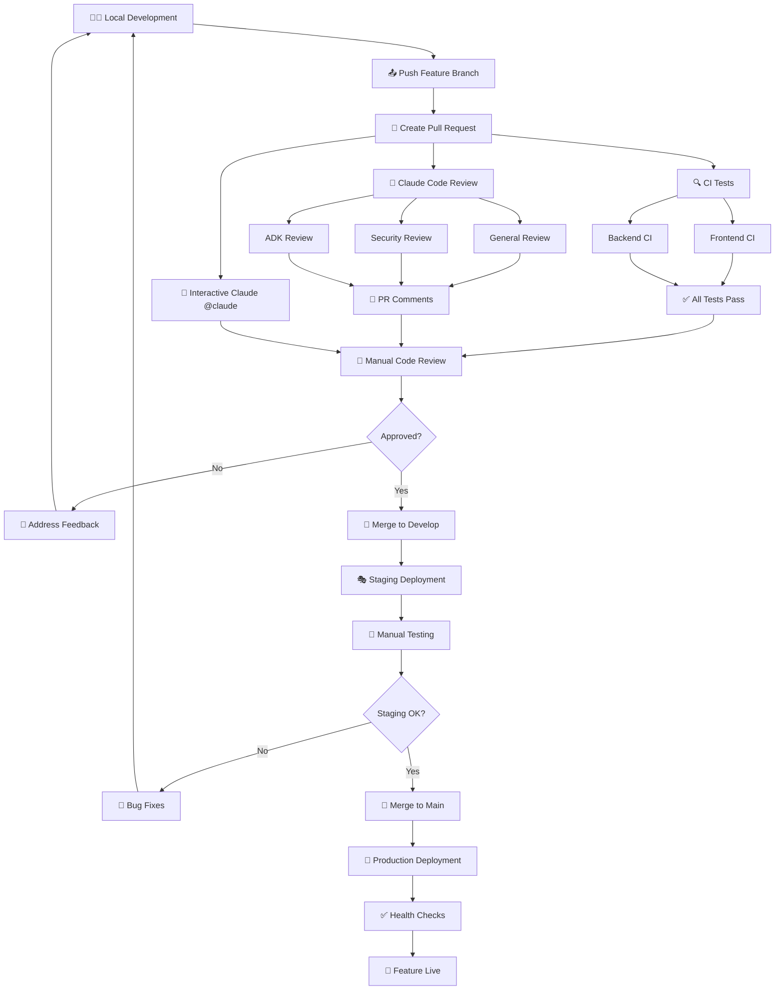

# Development Workflow Guide

## 🔄 Complete Workflow Visualization



## 📋 Detailed Workflow Steps

### Phase 1: Development & Testing

#### 🛠️ Local Development
```bash
# 1. Start from main branch
git checkout main
git pull origin main

# 2. Create feature branch
git checkout -b feature/issue-123-add-user-auth

# 3. Develop feature with local testing
./review-claude.sh security    # Security check
npm test                       # Frontend tests
cd backend && pytest           # Backend tests

# 4. Commit and push
git add .
git commit -m "feat: add user authentication system"
git push origin feature/issue-123-add-user-auth
```

### Phase 2: Automated Quality Assurance

#### 🔀 Pull Request Creation (to `main`)

**Automatically Triggered:**

1. **🔍 Continuous Integration** (2-3 minutes)
   ```yaml
   Frontend CI:
   - Node.js 18 setup
   - npm ci (install dependencies)
   - npm run lint (ESLint)
   - npm test (Jest tests)
   - npm run build (production build)
   
   Backend CI:
   - Python 3.11 + uv setup
   - uv sync (install dependencies)
   - flake8 + black + isort (linting)
   - pytest (test suite + coverage)
   - mypy (type checking)
   ```

2. **🤖 Claude Code Review** (1-2 minutes)
   ```yaml
   Reviews Generated:
   - General: TypeScript, React, Python, FastAPI best practices
   - Security: XSS, CSRF, injection attacks, auth bypasses
   - ADK-Specific: Streaming patterns, session management
   - Output: Detailed PR comments with actionable feedback
   ```

3. **💬 Interactive Claude Support**
   ```yaml
   Usage:
   - Comment "@claude explain this change"
   - "@claude is this secure?"
   - "@claude suggest improvements"
   ```

### Phase 3: Human Review & Approval

#### 👥 Manual Code Review Process

**Quality Gates:**
- [ ] ✅ All CI tests pass
- [ ] 🤖 Claude review feedback addressed
- [ ] 📋 Code follows project standards
- [ ] 🧪 Test coverage maintained (>90%)
- [ ] 📚 Documentation updated
- [ ] 🔒 Security considerations reviewed

**Review Checklist:**
```markdown
- [ ] Feature works as intended
- [ ] No breaking changes
- [ ] Error handling implemented
- [ ] Performance impact acceptable
- [ ] UI/UX follows design system
- [ ] API contracts maintained
```

### Phase 4: Staging Deployment

#### 🚀 Merge to `develop` Branch

**Automatically Triggered:**
```yaml
Staging Deployment (staging-deploy.yml):
- Direct Vercel staging deployment (no redundant CI tests)
- Preview URL generated
- Staging environment updated
- Focus on manual integration testing

Note: CI tests are NOT re-run on develop branch because:
✅ Branch protection ensures develop only receives tested code
✅ All tests already passed during PR review phase  
✅ Staging purpose is integration/UI testing, not unit testing
✅ Faster deployment = quicker feedback loop
```

#### 🧪 Manual Staging Verification

**Testing Checklist:**
```bash
# Frontend Testing
- [ ] UI renders correctly
- [ ] User flows work end-to-end
- [ ] Responsive design verified
- [ ] Accessibility tested
- [ ] Performance acceptable

# Backend Testing  
- [ ] API endpoints functional
- [ ] Authentication working
- [ ] Database operations correct
- [ ] External integrations working
- [ ] Error handling appropriate

# Integration Testing
- [ ] Frontend-backend communication
- [ ] Third-party services (ADK, etc.)
- [ ] Data flow correctness
```

### Phase 5: Production Deployment

#### 🌟 Merge to `main` Branch

**Automatically Triggered:**
```yaml
Production Deployment:
- Final CI test run
- Vercel production deployment
- Health checks executed
- Monitoring alerts enabled
```

**Post-Deployment Verification:**
```bash
# Automated Health Checks
✅ /health endpoint responding
✅ /api/health ADK status
✅ Database connectivity
✅ External API connectivity

# Manual Verification
- [ ] Critical user paths working
- [ ] No errors in monitoring
- [ ] Performance within SLA
- [ ] Feature flags working (if applicable)
```

## 🛡️ Quality Assurance Layers

### 1. **Pre-Commit** (Local)
```bash
# Recommended pre-commit hooks
./review-claude.sh security
npm run lint
npm test
```

### 2. **Pull Request** (Automated)
- ✅ CI Tests (Frontend + Backend)
- 🤖 Claude Code Review
- 💬 Interactive Claude Support
- 📊 Test Coverage Reports

### 3. **Code Review** (Human)
- 👥 Peer Review (1+ approvals required)
- 📋 Standards Compliance
- 🔒 Security Assessment
- 📚 Documentation Review

### 4. **Staging** (Manual)
- 🧪 Feature Testing
- 🎨 UI/UX Verification
- 🔗 Integration Testing
- ⚡ Performance Testing

### 5. **Production** (Automated + Monitored)
- 🚀 Automated Deployment
- 🏥 Health Checks
- 📊 Real-time Monitoring
- 🚨 Alert Systems

## 🔧 Required Infrastructure Setup

### GitHub Repository Configuration

#### Branch Protection Rules
```yaml
main:
  - Require pull request reviews: 1
  - Require status checks to pass: ✅
  - Require branches to be up to date: ✅
  - Restrict pushes to matching branches: ✅
  - Required status checks:
    - test-frontend
    - test-backend
    - claude-review

develop:
  - Require status checks to pass: ✅
  - Required status checks:
    - test-frontend
    - test-backend
```

#### Repository Secrets
```bash
ANTHROPIC_API_KEY     # For Claude Code Review
VERCEL_TOKEN          # For Vercel deployments
ORG_ID               # Vercel organization ID  
PROJECT_ID           # Vercel project ID
```

### Vercel Configuration

#### Environment Variables
```bash
# Production
GOOGLE_API_KEY=prod_key
GOOGLE_GENAI_USE_VERTEXAI=FALSE
DEBUG=false

# Preview/Staging
GOOGLE_API_KEY=staging_key  
GOOGLE_GENAI_USE_VERTEXAI=FALSE
DEBUG=true
```

## 🚨 Emergency Procedures

### Hotfix Workflow
```bash
# 1. Critical production issue identified
git checkout main
git checkout -b hotfix/critical-security-fix

# 2. Minimal fix implementation
# Make only essential changes

# 3. Expedited review process
# Create PR to main (skip develop)
# Require only 1 approval
# Fast-track CI/CD

# 4. Immediate deployment
# Monitor closely post-deployment
# Prepare rollback plan

# 5. Backport to develop
git checkout develop
git cherry-pick <hotfix-commit>
```

### Rollback Procedure
```bash
# Vercel Rollback
vercel --prod rollback <previous-deployment-url>

# Git Rollback
git revert <problematic-commit>
git push origin main

# Database Rollback (if needed)
# Run rollback migration scripts
```

## 📊 Metrics & Monitoring

### Development Metrics
- 📈 PR Throughput (PRs/week)
- ⏱️ Lead Time (Feature → Production)
- 🐛 Bug Escape Rate
- 🔄 Deployment Frequency
- ⚡ Mean Time to Recovery

### Code Quality Metrics
- 📊 Test Coverage (Target: >90%)
- 🤖 Claude Review Compliance
- 🔍 Static Analysis Results
- 📋 Code Review Approval Time

### Deployment Metrics
- 🚀 Deployment Success Rate (Target: >99%)
- ⏱️ Deployment Duration
- 🏥 Health Check Success Rate
- 📊 Performance Impact

---

This workflow ensures high code quality, security, and reliability while maintaining development velocity through automation and clear processes.