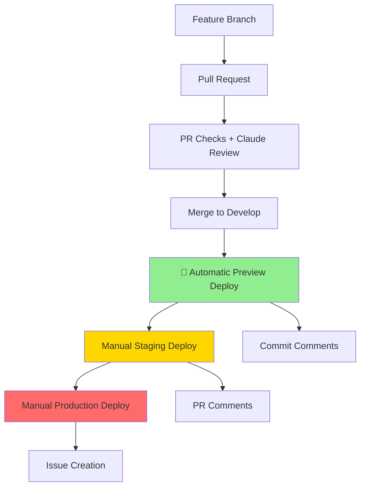

# Vercel Automatic Deployment Workflow

This document describes the automated deployment pipeline for the AI System Design Learning Platform.

## Deployment Environments

### 1. Preview Deployments (Automatic)
**Trigger:** Push to `develop` branch  
**URL Pattern:** `https://learn-with-ai-[hash].vercel.app`  
**Purpose:** Automatic testing and validation of merged features

#### Features:
- ✅ Automatic deployment on develop branch updates
- ✅ Health checks and API testing
- ✅ Deployment status comments on commits
- ✅ Backend test validation before deployment
- ✅ Frontend build verification

#### Workflow: `.github/workflows/preview-deploy.yml`

### 2. Staging Deployments (Manual)
**Trigger:** Manual workflow dispatch  
**URL Pattern:** `https://learn-with-ai-staging.vercel.app`  
**Purpose:** Manual testing and validation before production

#### Features:
- 🎯 Deploy specific PR for testing
- 🔍 Manual validation and approval process
- 📝 Deployment tracking via PR comments
- 🚀 Gateway to production deployment

#### Workflow: `.github/workflows/manual-staging.yml`

### 3. Production Deployments (Manual + Confirmation)
**Trigger:** Manual workflow dispatch with confirmation  
**URL Pattern:** `https://learn-with-ai.vercel.app`  
**Purpose:** Live production environment

#### Features:
- 🔒 Requires typing "PRODUCTION" for confirmation
- 🧪 Comprehensive test suite before deployment
- 🌟 Production health checks and monitoring
- 📢 Automatic deployment announcements
- 🎯 Deploy from any git ref (branch/tag/commit)

#### Workflow: `.github/workflows/production-deploy.yml`

## Deployment Pipeline Flow



## Required Secrets

Add these secrets to your GitHub repository:

```bash
# Vercel Configuration
VERCEL_TOKEN=your_vercel_token
VERCEL_ORG_ID=your_org_id
VERCEL_PROJECT_ID=your_project_id

# Optional: Custom deployment URLs
VERCEL_STAGING_URL=learn-with-ai-staging.vercel.app
VERCEL_PRODUCTION_URL=learn-with-ai.vercel.app
```

## Usage Examples

### Preview Deployment (Automatic)
Happens automatically when you merge PRs to develop:

```bash
git checkout develop
git pull origin develop
# Preview deployment starts automatically
```

### Manual Staging Deployment
1. Go to GitHub Actions
2. Select "Manual Staging Deploy"
3. Enter PR number to deploy
4. Click "Run workflow"

### Production Deployment
1. Go to GitHub Actions
2. Select "Production Deploy"
3. Type "PRODUCTION" in confirmation field
4. Enter git ref (usually "develop")
5. Click "Run workflow"

## Health Checks

Each deployment includes automatic health checks:

### Preview & Staging
- ✅ API health endpoint (`/api/health`)
- ✅ Root endpoint accessibility (`/`)
- ✅ Backend test suite validation

### Production
- ✅ Extended health monitoring (60s wait time)
- ✅ Comprehensive API testing
- ✅ Frontend build verification
- ✅ Performance baseline validation

## Monitoring and Rollbacks

### Deployment Status
- **Preview:** Commit comments with deployment URLs
- **Staging:** PR comments with testing instructions
- **Production:** GitHub issues for deployment tracking

### Rollback Process
1. Identify last known good commit
2. Run production deployment with previous git ref
3. Monitor health checks
4. Update documentation

## Troubleshooting

### Common Issues

#### Deployment Fails with "Build Error"
```bash
# Check frontend build locally
cd frontend && npm run build

# Check backend tests locally
cd backend && source .venv/bin/activate && pytest
```

#### Health Checks Fail
```bash
# Test endpoints manually
curl https://your-deployment.vercel.app/api/health
curl https://your-deployment.vercel.app/
```

#### Vercel Authentication Issues
1. Verify `VERCEL_TOKEN` secret is set
2. Check token permissions in Vercel dashboard
3. Ensure project and org IDs are correct

### Debug Commands

```bash
# Test deployment locally
vercel dev

# Build and test locally
npm run build && npm start

# Run backend in dev mode
cd backend && uvicorn app.main:app --reload
```

## Performance Monitoring

### Deployment Metrics
- ⏱️ Build time: Target < 3 minutes
- 🚀 Deploy time: Target < 2 minutes  
- 🏥 Health check: Target < 10 seconds
- 📊 Test coverage: Maintain > 80%

### Success Criteria
- ✅ All tests pass
- ✅ Health checks respond within 5 seconds
- ✅ Frontend builds without errors
- ✅ Backend API endpoints accessible
- ✅ ADK integration functional

## Next Steps

### Future Enhancements
1. **Database Integration:** Add PostgreSQL health checks
2. **Performance Testing:** Load testing in staging
3. **Security Scanning:** SAST/DAST integration
4. **Monitoring:** Comet Opik integration
5. **Notifications:** Slack/Discord deployment updates

### Configuration Options
- Custom deployment domains
- Environment-specific variables
- Advanced health check configurations
- Rollback automation
- Blue-green deployments